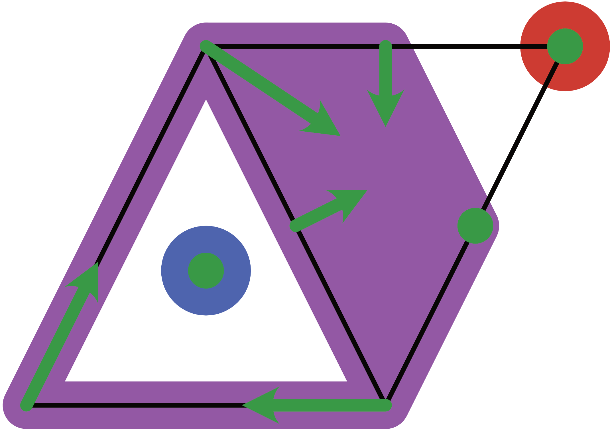

# ConleyDynamics.jl

*Conley index and multivector fields for Julia.*

ConleyDynamics.jl is a Julia package for studying combinatorial multivector
fields using Conley theory. The multivector fields can be studied on arbitrary
Lefschetz complexes, which include both simplicial and cubical complexes
as important special cases. The concept of combinatorial multivector field
generalizes Forman vector fields, which were originally introduced to study
Morse theory in a discrete combinatorial setting.

The detailed documentation can be found
[here](https://almost6heads.github.io/ConleyDynamics.jl/dev).

