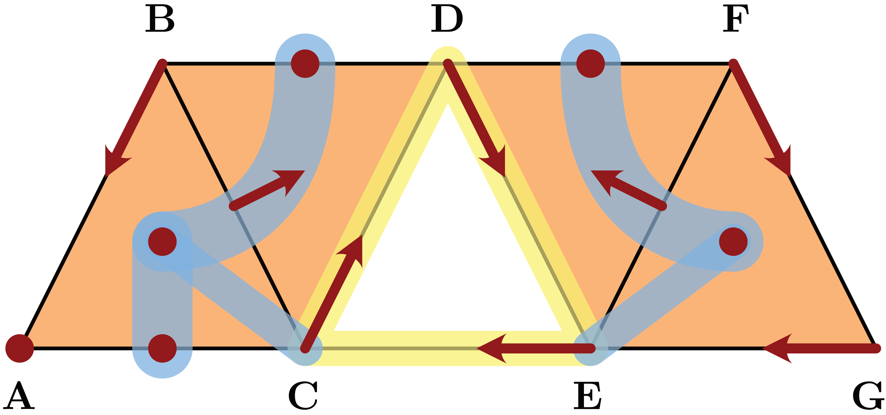
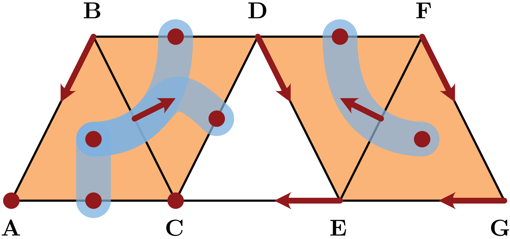
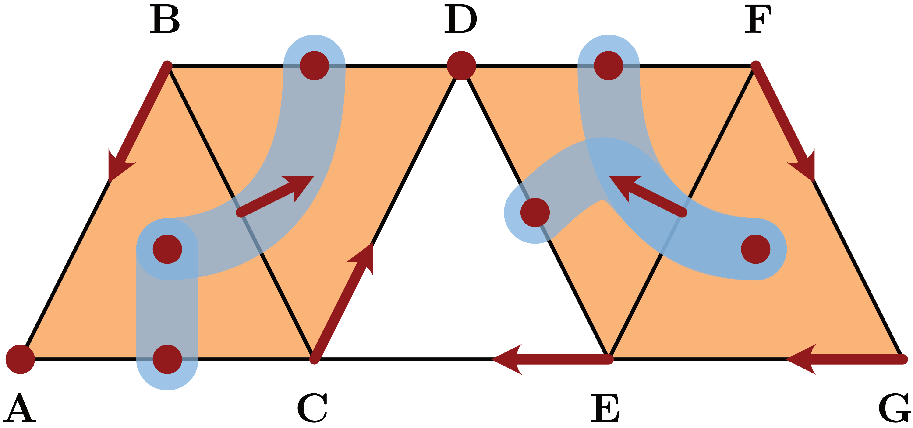
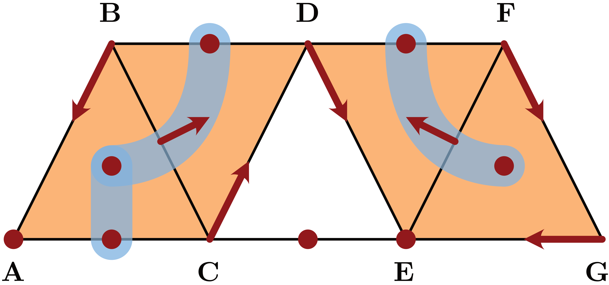

# Examples

*Conley index and multivector fields for Julia.*

A Julia package for studying combinatorial multivector fields using Conley theory

!!! note

    This package and the documentation is still very much work in progress!









```@docs
example_MW_fig01()
example_MW_fig02()
example_MW_fig03()
example_MW_fig04()
example_MW_fig11()
```

