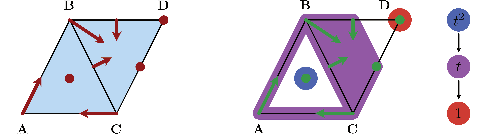
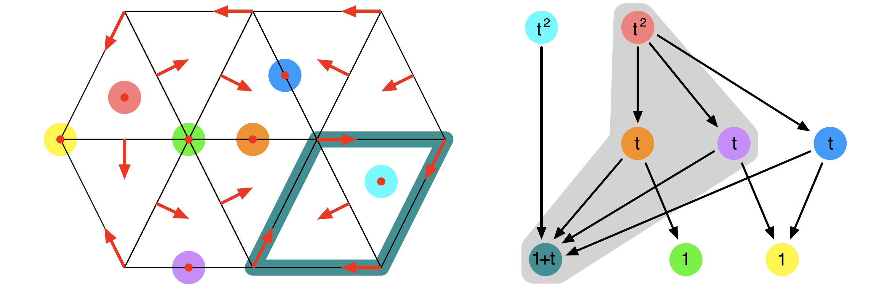
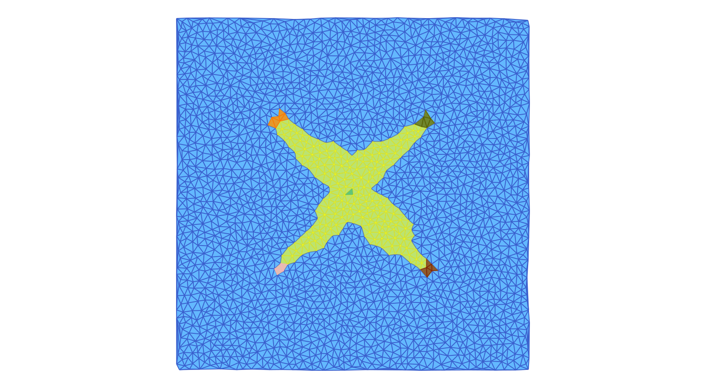
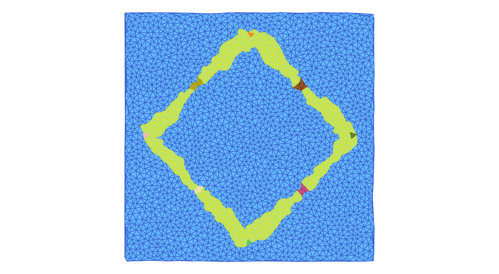
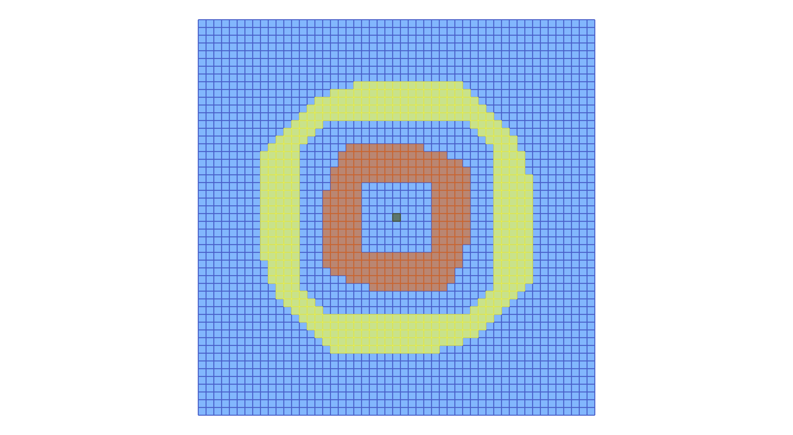
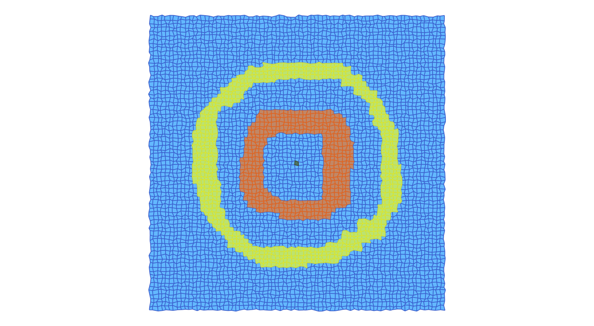
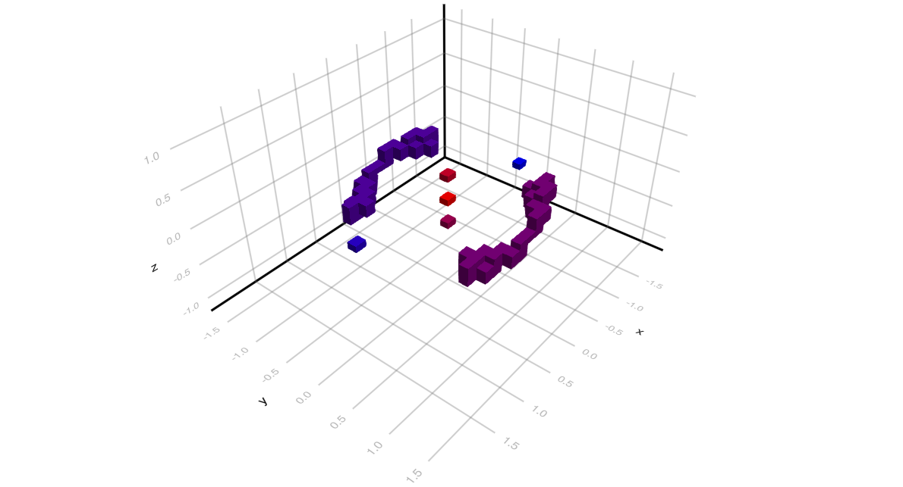
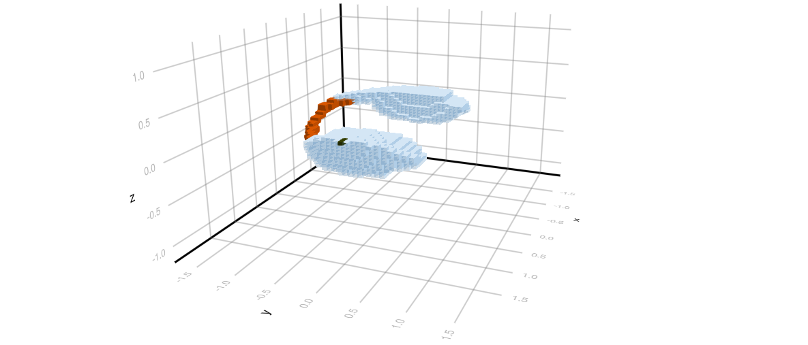
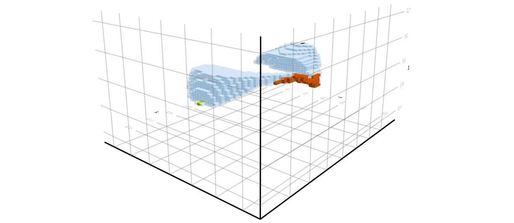

# Conley Theory

The main motivation for
[ConleyDynamics.jl](https://almost6heads.github.io/ConleyDynamics.jl)
is the development of an accessible tool for studying the global
dynamics of multivector fields on Lefschetz complexes. Having already
discussed the latter, we now turn our attention to multivector fields
and their global dynamics. This involves a detailed discussion of
multivector fields, isolated invariant sets, their Conley index,
as well as Morse decompositions and connection matrices. We also
describe how a variety of isolated invariant sets can be
constructed using Morse decomposition intervals, and apply these
tools to the analysis of simple planar and three-dimensional
ordinary differential equations.

## Multivector Fields

Suppose that ``X`` is a Lefschetz complex as described in
[Lefschetz Complexes](@ref), see in particular the definition
in [Basic Lefschetz Terminology](@ref). Assume further that the
Lefschetz complex is defined over a field ``F``, which is either
the rational numbers ``\mathbb{Q}`` or a finite field of prime
order. Then a *multivector field* on ``X`` is defined as follows.

!!! tip "Definition: Multivector field"
    A *multivector field* ``\mathcal{V}`` on a Lefschetz complex
    ``X`` is a partition of ``X`` into locally closed sets.

Recall from our detailed discussion in [Basic Lefschetz Terminology](@ref)
that a set ``V \subset X`` is called locally closed if its mouth
``\mathrm{mo}\, V = \mathrm{cl}\, V \setminus V`` is closed, where
closedness in turn is defined via the face relation in a Lefschetz
complex. This implies that for each multivector ``V \in \mathcal{V}``
the relative homology ``H_*(\mathrm{cl}\, V, \mathrm{mo}\, V)``
is well-defined, and it allows for the following classification
of multivectors:

* A *critical multivector* is a multivector for which
  ``H_*(\mathrm{cl}\, V, \mathrm{mo}\, V) \neq 0``.
* A *regular multivector* is a multivector for which
  ``H_*(\mathrm{cl}\, V, \mathrm{mo}\, V) = 0``.

Since a multivector is locally closed, it is a Lefschetz subcomplex
of ``X`` as well, and we have already seen that its Lefschetz homology
satisfies ``H_*(V) \cong H_*(\mathrm{cl}\, V, \mathrm{mo}\, V)``.
For more details, see [Relative Homology](@ref).

The above classification of multivectors is motivated by the
case of classical *Forman vector fields*. These are a special 
case of multivector fields, in that they also form a partition
of the underlying Lefschetz complex. This time, however, there 
are only two types of multivectors:

* A *critical cell* is a multivector consisting of exactly
  one cell of the Lefschetz complex. One can easily see that
  in this case the ``k``-th homology group is isomorphic
  to ``F``, as long as the cell has dimension ``k``. All
  other homology groups vanish. Thus, every critical cell 
  is a critical multivector.
* A *Forman arrow* is a multivector consisting of two
  cells ``\sigma^-`` and ``\sigma^+``, where ``\sigma^-``
  is a facet of ``\sigma^+``. In other words, one has to
  have ``\kappa(\sigma^+, \sigma^-) \neq 0``, which also
  implies that ``1 + \dim\sigma^- = \dim\sigma^+``. One
  can show that all homology groups of a Forman arrow are
  zero, and therefore it is a regular multivector.

In [ConleyDynamics.jl](https://almost6heads.github.io/ConleyDynamics.jl),
multivector fields can be created in two different ways. The
direct method is to specify all multivectors of length larger
than one in an array of type `Vector{Vector{Int}}` or
`Vector{Vector{String}}`, depending on whether the involved cells
are referenced via their indices or labels. Recall that it is
easy to convert between these two forms using the command
[`convert_cellsubsets`](@ref). The subsets specified by the vector
entries have to be disjoint. They do not, however, have to exhaust 
the underlying Lefschetz complex ``X``. Any cells that are not part
of a specified multivector will be considered as one-element critical
cells. This reduces the size of the representation in many situations.

For large Lefschetz complexes, the above method becomes quickly 
impractical. In such a case it is easier to determine a multivector
field indirectly, through a mechanism involving *dynamical 
transitions*. This is based on the following result.

!!! danger "Theorem: Multivector fields via dynamical transitions"
    Let ``X`` be a Lefschetz complex and let ``\mathcal{D}`` denote
    an arbitrary collection of subsets of ``X``. Then there exists
    a uniquely determined minimal multivector field ``\mathcal{V}``
    which satisfies the following:
    * For every ``D \in \mathcal{D}`` there exists a
      ``V \in \mathcal{V}`` such that ``D \subset V``.
    Note that the sets in ``\mathcal{D}`` do not have to be disjoint,
    and their union does not have to exhaust ``X``. One can think of
    the sets in ``\mathcal{D}`` as all allowable dynamical transitions.

The above result shows that as long as one has an idea about the 
transitions that a system has to be allowed to do, one can always
find a smallest multivector field which realizes them. Needless to
say, if too many transitions are specified, then it is possible that
the result leads to the trivial multivector field ``\mathcal{V} =
\{ X \}``. In most cases, however, the resulting multivector field
is more useful. See also the examples later in this section of the
manual.

The package
[ConleyDynamics.jl](https://almost6heads.github.io/ConleyDynamics.jl)
provides a number of functions for creating and manipulating multivector
fields on Lefschetz complexes:

* The function [`create_mvf_hull`](@ref) implements the above
  theorem on dynamical transitions. It expects two input arguments:
  A Lefschetz complex `lc`, as well as a vector `mvfbase` that defines
  the dynamical transitions in ``\mathcal{D}``. The latter has to have
  type `Vector{Vector{Int}}` or `Vector{Vector{String}}`.
* The function [`mvf_information`](@ref) displays basic information
  about a given multivector field. It expects both a Lefschetz complex
  and a multivector field as arguments, and returns a `Dict{String,Any}`
  with the information. The `keys` of this dictionary are as follows:
  - `"N mv"`: Number of multivectors
  - `"N critical"`: Number of critcal multivectors
  - `"N regular"`: Number of regular multivectors
  - `"Lengths critical"`: Length distribution of critical multivectors
  - `"Lengths regular"`: Length distribution of regular multivectors
  In the last two cases, the dictionary entries are vectors of pairs
  `(length,frequency)`, where each pair indicates that there are
  `frequency` multivectors of length `length`.
* The function [`extract_multivectors`](@ref) expects as input arguments
  a Lefschetz complex and a multivector field, as well as a list of
  cells specified as a `Vector{Int}` or a `Vector{String}`. It returns
  a list of all multivectors that contain the specified cells.
* The function [`create_planar_mvf`](@ref) creates a multivector field
  which approximates the dynamics of a given planar vector field. It
  expects as arguments a two-dimensional Lefschetz complex, a vector
  of planar coordinates for the vertices of the complex, as well as a
  function which implements the vector field. It returns a multivector
  field based on the dynamical transitions induced by the vector field
  directions on the vertices and edges of the Lefschetz complex.
  While the complex does not have to be a triangulation, it is 
  expected that the one-dimensional cells are straight line segments
  between the two boundary vertices.
* The utility function [`planar_nontransverse_edges`](@ref) expects
  the same arguments as the previous one, and returns a list of
  nontransverse edges as `Vector{Int}`, which contains the corresponding
  edge indices. The optional parameter `npts` determines how many points
  along an edge are evaluated for the transversality check.
* The function [`create_spatial_mvf`](@ref) creates a multivector field
  which approximates the dynamics of a given spatial vector field.
  While it expects the same arguments as its planar counterpart, the
  Lefschetz complex has to be of one of the following two types:
  - The Lefschetz complex is a *tetrahedral mesh* of a region in
    three dimensions, i.e., it is a simplicial complex.
  - The Lefschetz complex is a three-dimensional *cubical complex*,
    i.e., it is the closure of a collection of three-dimensional
    cubes in space.
  In the second case, the vertex coordinates can be slightly perturbed
  from the original position in the cubical lattice, as long as the
  overall structure of the complex stays intact. In that case, the
  faces are interpreted as Bezier surfaces with straight edges.

All of these functions will be illustrated in more detail in the
examples which are presented later in this section. See also the
[Tutorial](@ref) for another planar vector field analysis.

## Invariance and Conley Index

A multivector field induces dynamics on the underlying Lefschetz
complex through the iteration of a multivalued map. This
*flow map* is given by

```math
   \Pi_{\mathcal V}(x) = \mathrm{cl}\, x \cup [x]_{\mathcal V}
   \qquad\text{ for all }\qquad
   x \in X
```

where ``[x]_{\mathcal V}`` denotes the unique multivector in
``{\mathcal V}`` which contains ``x``. The definition of the
flow map shows that the induced dynamics combines two types
of behavior:

* From a cell ``x``, it is always possible to flow towards
  the boundary of the cell, i.e., to any one of its faces.
* In addition, it is always possible to move freely within
  a multivector.

The multivalued map ``\Pi_{\mathcal V} : X \multimap X``
naturally leads to a solution concept for multivector fields.
A *path* is a sequence ``x_0, x_1, \ldots, x_n \in X`` such
that ``x_k \in \Pi_{\mathcal{V}}(x_{k-1})`` for all indices
``k = 1,\ldots,n``. Paths of bi-infinite length are called
solutions. More precisely, a *solution* of the combinatorial
dynamical system induced by the multivector field is then a
map ``\rho : \mathbb{Z} \to X`` which satisfies
``\rho(k+1) \in \Pi_{\mathcal V}(\rho(k))`` for all
``k \in \mathbb{Z}``. We say that this solution *passes
through the cell* ``x \in X`` if in addition one has
``\rho(0) = x``. It is clear from the definition of the
flow map that every constant map is a solution, since we have
the inclusion ``x \in \Pi_{\mathcal V}(x)``. Thus, rather than
considering solutions in the above (classical) sense, we focus
on a more restrictive notion.

!!! tip "Definition: Essential solution"
    Let ``\rho : \mathbb{Z} \to X`` be a solution for the
    multivector field ``\mathcal{V}``. Then ``\rho`` is
    an *essential solution*, if the following holds:
    - If for ``k \in \mathbb{Z}`` the cell ``\rho(k)`` lies
      in a regular multivector ``V \in \mathcal{V}``, then there
      exist integers ``\ell_1 < k < \ell_2`` for which we have
      ``\rho(\ell_i) \not\in V`` for ``i = 1,2``.
    In other words, an essential solution has to leave a
    regular multivector both in forward and in backward time.
    It can, however, stay in a critical multivector for as long
    as it wants.

The notion of essential solution has its origin in the distinction
between critical and regular multivectors. In Forman's theory, 
which is based on classical Morse theory, critical cells correspond
to stationary solutions or equilibria of the underlying flow. Thus,
it has to be possible to stay in a critical multivector for all times,
whether in forward or backward time, or even for all times. On the other
hand, a Forman arrow indicates prescribed non-negotiable motion, and
therefore a regular multivector corresponds to motion which goes
from the multivector to its mouth.

The multivector field from the package logo, which is shown in the
accompanying image, consists of three critical cells, two Forman
arrows, as well as one multivector which consists of four cells.
Beyond the constant essenetial solutions in each of the three
critical cells, another essential solution is the *periodic
orbit*

```math
   \rho_P \;\text{ given by }\;
   \ldots \to \mathbf{A} \to \mathbf{AB} \to \mathbf{B}
     \to \mathbf{BCD} \to \mathbf{C} \to \mathbf{AC}
     \to \mathbf{A} \to \ldots
```

Notice that this is just one of many realizations of this particular
periodic motion, since an essential solution can take many different
paths through a multivector.



Using the concept of essential solutions we can now introduce the
notion of *invariance*. Informally, we say that a subset of a Lefschetz
complex is invariant if through every cell in the set there exists an
essential solution which stays in the set. In other words, we have the
choice of staying in the set, even though there might be other solutions
that do leave. More generally, for every subset ``A \subset X`` one can
ask whether there are elements ``x \in A`` for which there exists an
essential solution which passes through ``x`` and stays in ``A``
for all times. This leads to the definition of the *invariant part
of ``A``* as

```math
   \mathrm{Inv}_{\mathcal{V}}(A) =
   \left\{ x \in A \, : \,
      \text{there exists an essential solution }
      \rho : \mathbb{Z} \to A \text{ through } x
      \right\}
```

It is certainly possible that the invariant part of a set is 
empty. If, however, the invariant part of ``A`` is all of ``A``,
i.e., if we have ``\mathrm{Inv}_{\mathcal{V}}(A) = A``, then
the set ``A`` is called *invariant*. In the context of our
above logo example, the image of the essential solution
``\rho_P`` is clearly an invariant set.

Invariant sets are the fundamental building blocks for the global
dynamics of a dynamical system. Yet, in general they are difficult
to study. Conley realized in [conley:78a](@cite) that if one 
restricts the attention to a more specialized notion of invariance,
then topological methods can be used to formulate a coherent 
general theory. For this, we need to introduce the notion of 
*isolated invariant set*:

!!! tip "Definition: Isolated invariant set"
    A closed set ``N \subset X`` *isolates* an invariant set
    ``S \subset N``, if the following two conditions are satisfied:
    * Every path in ``N`` with endpoints in ``S`` is a path in
      ``S``.
    * We have ``\Pi_{\mathcal{V}}(S) \subset N``.
    An invariant set ``S`` is an *isolated invariant set*,
    if there exists a closed set ``N`` which isolates ``S``.

It is clear that the whole Lefschetz complex ``X`` isolates its
invariant part. Therefore, the set ``\mathrm{Inv}_{\mathcal{V}}(X)``
is an isolated invariant set. Moreover, one can readily show that
if ``N`` is an isolating set for an isolated invariant set ``S``,
then any closed set ``S \subset M \subset N`` also isolates ``S``.
Thus, the closure ``\mathrm{cl}\, S`` is the smallest isolating
set for ``S``. With these observations in mind, one obtains
the following result from [lipinski:etal:23a](@cite):

!!! danger "Theorem: Characterization of isolated invariant sets"
    An invariant set ``S \subset X`` is an isolated invariant set,
    if and only if the following two conditions hold:
    * ``S`` is *``\mathcal{V}``-compatible*, i.e., it is the union
      of multivectors.
    * ``S`` is locally closed.
    In this case, the isolated invariant set ``S`` is isolated
    by its closure ``\mathrm{cl}\, S``.

Returning to our earlier logo example, notice that the cells
visited by the periodic essential solution ``\rho_P`` do not
form an isolated invariant set, but rather just an invariant
set. However, if we consider the larger set ``S_P`` which
consists of all cells except for the cells ``\mathbf{ABC}``
and ``\mathbf{D}``, then we do obtain an isolated invariant
set which contains the periodic orbit ``\rho_P``.

With this characterization at hand, identifying isolated invariant
sets becomes straightforward. In addition, since isolated invariant
sets are locally closed, we can now also define their *Conley index*:

!!! tip "Definition: Conley index"
    Let ``S \subset X`` be an isolated invariant set the
    multivalued flow map ``\Pi_{\mathcal{V}}``. Then the
    *Conley index of ``S``* is the relative (or Lefschetz)
    homology
    ```math
       CH_*(S) = H_*( \mathrm{cl}\, S, \mathrm{mo}\, S)
               \cong H_*(S)
    ```
    In addition, the *Poincare polynomial of ``S``*
    is defined as
    ```math
       p_{S}(t) = \sum_{k=0}^\infty \beta_k(S) t^k \, ,
       \quad\text{where}\quad
       \beta_k(S) = \dim CH_k(S) \; .
    ```
    The Poincare polynomial is a concise way to encode the
    homology information.

Since the Conley index is nothing more than the relative
homology of the closure-mouth-pair associated with a locally
closed set, one could easily use the homology functions described
in [Homology](@ref) for its computation. However, we have included
a wrapper function to keep the notation uniform. In addition,
[ConleyDynamics.jl](https://almost6heads.github.io/ConleyDynamics.jl)
contains a function which provides basic information about an
isolated invariant set. These two functions can be described
as follows:

* The function [`conley_index`](@ref) determines the Conley
  index of an isolated invariant set. It expects a Lefschetz
  complex as its first argument, while the second one has to
  be a list of cells which specifies the isolated invariant 
  set, and which is either of type `Vector{Vector{Int}}`
  or `Vector{Vector{String}}`. An error is raised if the second
  argument does not specify a locally closed set.
* The function [`isoinvset_information`](@ref) expects a
  Lefschetz complex `lc::LefschetzComplex`, a multivector
  field `mvf::CellSubsets`, as well as an isolated invariant
  set `iis::Cells` as its three arguments. Itreturns a
  `Dict{String,Any}` with the information. The `keys` of
  this dictionary are as follows:
  - `"Conley index"` contains the Conley index of the 
    isolated invariant set.
  - `"N multivectors"` contains the number of multivectors
    in the isolated invariant set.

## Morse Decompositions

We now turn our attention to the global dynamics of a combinatorial
dynamical system. This is accomplished through the notion of
*Morse decomposition*, and it requires some auxilliary definitions:

* Suppose we are given a solution ``\varphi : \mathbb{Z} \to X`` for
  the multivector field ``\mathcal{V}``. Then the long-term limiting
  behavior of ``\varphi`` can be described using the *ultimate backward
  and forward images*
  ```math
     \mathrm{uim}^- \varphi =
     \bigcap_{t \in \mathbb{Z}^-} \varphi\left( (-\infty,t] \right)
     \qquad\text{and}\qquad
     \mathrm{uim}^+ \varphi =
     \bigcap_{t \in \mathbb{Z}^+} \varphi\left( [t,+\infty) \right) .
  ```
  Notice that since ``X`` is finite, there has to exist a
  ``k \in \mathbb{N}`` such that
  ```math
     \mathrm{uim}^- \varphi =
     \varphi\left( (-\infty,-k] \right) \neq \emptyset
     \qquad\text{and}\qquad
     \mathrm{uim}^+ \varphi =
     \varphi\left( [k,+\infty) \right) \neq \emptyset .
  ```
* The *``\mathcal{V}``-hull* of a set ``A \subset X`` is the
  intersection of all ``\mathcal{V}``-compatible and locally
  closed sets containing ``A``. It is denoted by
  ``\langle A \rangle_{\mathcal{V}}``, and is the smallest 
  candidate for an isolated invariant set which contains ``A``.
* The ``\alpha``- and ``\omega``-limit sets of ``\varphi``
  are then defined as
  ```math
     \alpha(\varphi) =
     \left\langle \mathrm{uim}^- \varphi \right\rangle_{\mathcal{V}}
     \qquad\text{and}\qquad
     \omega(\varphi) =
     \left\langle \mathrm{uim}^+ \varphi \right\rangle_{\mathcal{V}}.
  ```

While in general the ``\mathcal{V}``-hull of a set does not have
to be invariant, the following result shows that for every 
essential solution both of its limit sets are in fact isolated
invariant sets.

!!! danger "Theorem: Limit sets are nontrivial"
    Let ``\varphi`` be an essential solution in ``X``. Then both
    limit sets ``\alpha(\varphi)`` and ``\omega(\varphi)`` are
    nonempty isolated invariant sets.

We briefly pause to illustrate these concepts in the context
of the above logo example. For the periodic essential solution
``\rho_P``, both its ultimate backward and forward images 
are precisely the cells visited by the solution. The
``\mathcal{V}``-hull of ``\mathrm{im}\, \rho_P`` is the set ``S_P``
which consists of all cells except the index 0 and 2 critical
cells. It was already mentioned earlier that this indeed
defines an isolated invariant set.

The above notions allow us to decompose the global dynamics of
a multivector field. Loosely speaking, this is accomplished by
separating the dynamics into a recurrent part given by an indexed
collection of isolated invariant sets, and the gradient dynamics
between them. This can be abstracted through the concept of a
*Morse decomposition*.

!!! tip "Definition: Morse decomposition"
    Assume that ``X`` is an invariant set for the multivector
    field ``\mathcal{V}`` and that ``(\mathbb{P},\leq)`` is a
    finite poset. Then an indexed collection ``\mathcal{M} =
    \left\{ M_p \, : \, p \in \mathbb{P} \right\}`` is called a
    *Morse decomposition* of ``X`` if the following conditions are
    satisfied:
    * The indexed family ``\mathcal{M}`` is a family of mutually
      disjoint, isolated invariant subsets of ``X``.
    * For every essential solution ``\varphi`` in ``X`` either one has
      ``\mathrm{im} \, \varphi \subset M_r`` for an ``r \in \mathbb{P}``
      or there exist two poset elements ``p,q \in \mathbb{P}`` such
      that ``q > p`` and
      ```math
         \alpha(\varphi) \subset M_q
         \qquad\text{and}\qquad
         \omega(\varphi) \subset M_p .
      ```
      The elements of ``\mathcal{M}`` are called *Morse sets*. We
      would like to point out that some of the Morse sets could
      be empty.

Given a combinatorial multivector field ``\mathcal{V}`` on an
arbitrary Lefschetz complex ``X``, there always exists a finest
Morse decomposition ``\mathcal{M}``. It can be found by
determining those strongly connected components of the digraph
associated with the multivalued flow map ``\Pi_{\mathcal{V}} :
X \multimap X`` which contain essential solutions. The
associated *Conley-Morse graph* is the partial order induced
on ``\mathcal{M}`` by the existence of connections, and
represented as a directed graph labelled with the Conley indices
of the isolated invariant sets in ``\mathcal{M}`` in terms of
their Poincare polynomials.

In order to capture the dynamics between two subsets ``A,B \subset X``
one can define the *connection set* from ``A`` to ``B`` as the cell
collection

```math
   \mathcal{C}(A,B) =
   \left\{ x \in X \, : \,
     \exists \, \text{ essential solution }
     \varphi \text{ through } x \text{ with }
     \alpha(\varphi) \subset A \text{ and }
     \omega(\varphi) \subset B \right\} .
```

Then ``\mathcal{C}(A,B)`` is an isolated invariant set. We would 
like to point out, however, that the connection set can be, and
in fact will be, empty in many cases.

While the Morse sets of a Morse decomposition are the fundamental
building blocks for the global dynamics, there usually are many
additional isolated invariant sets for the multivector field
``\mathcal{V}``. Of particular interest are *Morse intervals*.
To define them, let ``I \subset \mathbb{P}`` denote an interval
in the index poset. Then

```math
   M_I \; = \; \bigcup_{p \in I} M_p \; \cup \;
               \bigcup_{p,q \in I} \mathcal{C}( M_q, M_p )
```

is always an isolated invariant set. Nevertheless, not every
isolated invariant set is of this form. For example, the figure
contains the multivector field which was discussed in
[batko:etal:20a; Figure 3](@cite). While the underlying simplicial
complex and the Forman vector field are depicted in the left panel,
the associated Conley-Morse graph is shown on the right. For this
combinatorial dynamical system, there exists an isolated invariant
set which contains only the four Morse sets within the gray region
under the graph. More details can be found in
[A Planar Forman Vector Field](@ref).



Morse decompositions and intervals can be easily computed 
and manipulated in
[ConleyDynamics.jl](https://almost6heads.github.io/ConleyDynamics.jl)
using the following commands:

* The function [`morse_sets`](@ref) expects a Lefschetz
  complex and a multivector field as arguments, and
  returns the Morse sets of the finest Morse decomposition
  as a `Vector{Vector{Int}}` or `Vector{Vector{String}}`,
  matching the format used for the multivector field.
  If the optional argument `poset=true` is added, then
  the function also returns a matrix which encodes the
  Hasse diagram of the poset ``\mathbb{P}``. Note that
  this is the transitive reduction of the full poset, 
  i.e., it only contains necessary relations.
* The function [`morse_interval`](@ref) computes the
  isolated invariant set for a Morse set interval.
  The three input arguments are the underlying Lefschetz
  complex, a multivector field, and a collection of Morse
  sets. The latter should be determined using the
  function [`morse_sets`](@ref). The function returns the
  smallest isolated invariant set which contains the Morse
  sets and their connections as a `Vector{Int}`. The result
  can be converted to label form using [`convert_cells`](@ref).
* The function [`restrict_dynamics`](@ref) restricts a multivector
  field to a Lefschetz subcomplex. The function expects three
  arguments: A Lefschetz complex `lc`, a multivector field
  `mvf`, and a subcomplex of the Lefschetz complex which is
  given by the locally closed set represented by `lcsub`.
  It returns the associated Lefschetz subcomplex `lcreduced`
  and the induced multivector field `mvfreduced` on the subcomplex.
  The multivectors of the new multivector field are the
  intersections of the original multivectors and the subcomplex.
* Finally, the function [`remove_exit_set`](@ref) removes the
  exit set for a multivector field on a Lefschetz subcomplex.
  It is assumed that the Lefschetz complex `lc` is a topological
  manifold and that `mvf` contains a multivector field that is
  created via either [`create_planar_mvf`](@ref) or
  [`create_spatial_mvf`](@ref). The function identifies cells
  on the boundary at which the flows exits the region covered
  by the Lefschetz complex. If this exit set is closed, one has
  found an isolated invariant set and the function returns a
  Lefschetz complex `lcr` restricted to it, as well as the
  restricted multivector field `mvfr`. If the exit set is not
  closed, a warning is displayed and the function returns the
  restricted Lefschetz complex and multivector field obtained
  by removing the closure of the exit set. *In the latter case,
  unexpected results might be obtained.*

The first two of these functions rely heavily on the Julia package
[Graphs.jl](http://juliagraphs.org/Graphs.jl/stable/).

## Connection Matrices

While a Morse decomposition represents the basic structure
of the global dynamics of a combinatorial dynamical system,
it does not directly provide more detailed information about
the dynamics between them -- except for the poset order on
the Morse sets. But which of the associated connecting sets
actually have to be nonempty? The algebra behind this question
is captured by the *connection matrix*. The precise notion
of connection matrix was introduced in [franzosa:89a](@cite),
see also [harker:etal:21a](@cite), as well as the book
[mrozek:wanner:25a](@cite) which treats connection matrices
specifically in the setting of multivector fields and provides
a precise definition of connection matrix equivalence, even 
across varying posets.

Since the precise definition of a connection matrix is 
beyond the scope of this manual, we only state what it is
as an object, what its main properties are, and how it can
be computed in
[ConleyDynamics.jl](https://almost6heads.github.io/ConleyDynamics.jl).
Assume therefore that we are given a Morse decomposition
``\mathcal{M}`` of an isolated invariant set ``S``. Then
the *connection matrix* is a linear map

```math
   \Delta \; : \; \bigoplus_{q \in \mathbb{P}} CH_*(M_q)
   \to \bigoplus_{p \in \mathbb{P}} CH_*(M_p) ,
```

i.e., it is a linear map which is defined on the direct sum of
all Conley indices of the Morse sets in the Morse decomposition.
One usually writes the connection matrix ``\Delta`` as a matrix
in the form ``\Delta = (\Delta(p,q))_{p,q \in \mathbb{P}}``,
which is indexed by the poset ``\mathbb{P}``, and where
the entries ``\Delta(p,q) : CH_*(M_q) \to CH_*(M_p)`` are
linear maps between homological Conley indices. If ``I``
denotes an interval in the poset ``\mathbb{P}``, then one
further defines the restricted connection matrix

```math
   \Delta(I) \; = \; \left( \Delta(p,q) \right)_{p,q \in I}
     \; : \; \bigoplus_{p \in I} CH_*(M_p) \to
     \bigoplus_{p \in I} CH_*(M_p) .
```

Any connection matrix ``\Delta`` has the following
fundamental properties:

* The matrix ``\Delta`` is *strictly upper triangular*, i.e.,
  if ``\Delta(p,q) \not= 0`` then ``p < q``.
* The matrix ``\Delta`` is a *boundary operator*, i.e., we
  have ``\Delta \circ \Delta = 0``, and ``\Delta`` maps
  ``k``-th level homology to ``(k-1)``-st level homology
  for all ``k \in \mathbb{Z}``.
* For every interval ``I`` in ``\mathbb{P}`` we have
  ```math
     H_*\Delta(I) \; = \;
     \mathrm{ker}\, \Delta(I) / \mathrm{im}\, \Delta(I)
     \; \cong \; CH_*(M_I) .
  ```
  In other words, the *Conley index of a Morse interval*
  can be determined via the *homology* of the associated
  *connection matrix minor* ``\Delta(I)``.
* If ``\{ p, q \}`` is an interval in ``\mathbb{P}`` and
  ``\Delta(p,q) \neq 0``, then the *connection set
  ``\mathcal{C}(M_q,M_p)`` is not empty*.

We would like to point out that these properties do not
characterize connection matrices. In practice, a given
multivector field can have several different connection
matrices. These in some sense encode different types of
dynamical behavior that can occur in the system.
Nonuniqueness, however, cannot be observed if the underlying
system is a *gradient combinatorial Forman vector field* on
a Lefschetz complex. These are multivector fields in which
every multivector is either a singleton, and therefore
a critical cell, or a two-element Forman arrow. In
addition, a gradient combinatorial Forman vector field
cannot have any nontrivial periodic solutions, i.e., 
periodic solutions which are not constant and therefore
critical cells. For such combinatorial vector fields,
the following result was shown in
[mrozek:wanner:25a](@cite).

!!! danger "Theorem: Uniqueness of connection matrices"
    If ``\mathcal{V}`` is a gradient combinatorial Forman
    vector field and ``\mathcal{M}`` its finest Morse
    decomposition, then the connection matrix is
    uniquely determined.

In [ConleyDynamics.jl](https://almost6heads.github.io/ConleyDynamics.jl)
connection matrices can be computed over arbitrary finite fields or the
rationals, using the persistence-like algorithm introduced
in [dey:etal:24a](@cite):

* The function [`connection_matrix`](@ref) computes a connection matrix
  for the multivector field `mvf` on the Lefschetz complex `lc` over the
  field associated with the Lefschetz complex boundary matrix. The function
  returns an object of type [`ConleyMorseCM`](@ref), which is further
  described below. If the optional argument `returnbasis=true` is given,
  then the function also returns a dictionary which gives the basis
  for the connection matrix columns in terms of the original cell labels.

The connection matrix is returned in an object with the composite
data type [`ConleyMorseCM`](@ref). Its docstring is as follows:

```@docs; canonical=false
ConleyMorseCM
```

To illustrate these fields further, we briefly illustrate them
for the example associated with the last figure, see again
[A Planar Forman Vector Field](@ref). For reference, the 
underlying simplicial complex and Forman vector field are
shown in the next figure.


The underlying Lefschetz complex, multivector field, and
connection matrix can be computed over the field ``GF(2)``
as follows:

```@example Cconnmatrix
using ..ConleyDynamics # hide
lc, mvf, coords = example_forman2d()
cm = connection_matrix(lc, mvf)
sparse_show(cm.matrix)
```

The field `cm.poset` indicates which Morse set each column
belongs to, while the field `cm.labels` shows which cell
label the column corresponds to. For the example one obtains:

```@example Cconnmatrix
print(cm.poset)
```

```@example Cconnmatrix
print(cm.labels)
```

Note that except for the third and fourth column, all columns
belong to unique Morse sets whose Conley index is a one-dimensional
vector space. The third and fourth column correspond to the 
periodic orbit, whose Conley index is a two-dimensional vector 
space. The Conley indices for all eight Morse sets can be seen
in the field `cm.conley`:

```@example Cconnmatrix
cm.conley
```

The full associated Morse sets are list in `cm.morse`:

```@example Cconnmatrix
cm.morse
```

As the final struct field, the entry `cm.complex` returns the
connection matrix as a Lefschetz complex in its own right.
This is useful for determining the Conley indices of Morse
intervals. In our example, the cells of the new Lefschetz
complex are given by

```@example Cconnmatrix
cm.complex.labels
```

The Morse interval consisting of the two index 2 critical
cells ``\mathbf{ADE}`` and ``\mathbf{FGJ}`` should have
as Conley index the sum of the two individual indices,
and the following computation demonstrates this:

```@example Cconnmatrix
conley_index(cm.complex, ["ADE", "FGJ"])
```

In contrast, since there is exactly one connecting orbit
between ``\mathbf{ADE}`` and ``\mathbf{BF}``, the Conley
index of this interval should be trivial:

```@example Cconnmatrix
conley_index(cm.complex, ["ADE", "BF"])
```

Finally, there are exactly two connecting orbits
between the Morse sets ``\mathbf{ADE}`` and ``\mathbf{EF}``,
and therefore the Conley index of this last interval is
again the sum of the separate indices:

```@example Cconnmatrix
conley_index(cm.complex, ["ADE", "EF"])
```

## Extracting Subsystems

We briefly return to one of the examples in the tutorial. More precisely, we
consider the planar ordinary differential equation given by

```math
   \begin{array}{rcl}
     \dot{x}_1 & = & x_1 \left( 1 - x_1^2 - 3 x_2^2 \right) \\[1ex]
     \dot{x}_2 & = & x_2 \left( 1 - 3 x_1^2 - x_2^2 \right)
   \end{array}
```

The dynamics of this system is characterized by the existence of a global
attractor in the shape of a closed disk. Inside the attractor, there are
nine different Morse sets:

- The origin is an equilibrium of index 2, i.e., it is an unstable
  stationary state with a two-dimensional unstable manifold.
- The four points ``(\pm 1/2, \pm 1/2)`` are unstable equilibria of
  index 1, i.e., with a one-dimensional unstable manifold.
- Finally, the four points ``(\pm 1, 0)`` and ``(0, \pm 1)`` are
  asymptotically stable stationary states.

We saw in the tutorial that the Morse decomposition of this system
can easily be found using
[ConleyDynamics.jl](https://almost6heads.github.io/ConleyDynamics.jl),
as well as the associated connection matrix. Yet, in certain situations
one might only be interested in part of the dynamics on the attractor.
Moreover, while the Morse sets describe the recurrent part of the dynamics,
they do not provide information on the geometry of the connecting sets between
the Morse sets. In the following, we illustrate how this can be analyzed
further.

The right-hand side of the above vector field can be implemented using
the Julia function

```@example Cmorseinterval
using ..ConleyDynamics # hide
using Random # hide
Random.seed!(1234) # hide
function planarvf(x::Vector{Float64})
    #
    # Sample planar vector field with nontrivial Morse decomposition
    #
    x1, x2 = x
    y1 = x1 * (1.0 - x1*x1 - 3.0*x2*x2)
    y2 = x2 * (1.0 - 3.0*x1*x1 - x2*x2)
    return [y1, y2]
end
```

To analyze the resulting global dynamical behavior, we first create a
simplicial mesh covering the square ``[-6/5, 6/5]^2`` using the commands

```@example Cmorseinterval
lc, coords = create_simplicial_delaunay(300, 300, 5, 50);
coordsN = convert_planar_coordinates(coords,[-1.2,-1.2], [1.2,1.2]);
lc.ncells
```

The integer in the output gives the number of cells in the created Lefschetz
complex ``X``. Note that we are using a Delaunay triangulation over an initial
box of size ``300 \times 300``, where the target triangle size is about 5.
This box is then rescaled to cover the above square. We can then create a 
multivector field on the simplicial complex `lc` and find its Morse
decomposition using the commands

```@example Cmorseinterval
mvf = create_planar_mvf(lc, coordsN, planarvf);
morsedecomp = morse_sets(lc, mvf);
length(morsedecomp)
```

As expected,
[ConleyDynamics.jl](https://almost6heads.github.io/ConleyDynamics.jl)
finds exactly nine Morse sets. Their Conley indices can be computed
and stored in a `Vector{Vector{Int}}` using the command

```@example Cmorseinterval
conleyindices = [conley_index(lc, mset) for mset in morsedecomp]
```

These Conley indices correspond to the dynamical behavior near the
equilibrium solutions described above.

Suppose now that rather than finding the connection matrix for the
complete Morse decomposition, we would only like to consider a 
part of it. This can be done as long as we restrict our attention
to an *interval in the Morse decomposition*. Such an interval
``\mathcal{I}`` can be created from a selection ``\mathcal{S}``
of the Morse sets in the following way:

- In addition to the Morse sets in ``\mathcal{S}``, the interval
  ``\mathcal{I}`` contains all Morse sets that lie between two
  Morse sets in ``\mathcal{S}`` with respect to the poset order
  underlying the Morse decomposition. Recall that this poset order
  can be computed via [`morse_sets`](@ref) by activating the extra
  return object `hasse`, which describes the Hasse diagram of the
  poset.

With every interval ``\mathcal{I}`` of the Morse decomposition one
can assign a smallest isolated invariant set ``X_{\mathcal{I}}
\subset X`` which describes the complete dynamics within and
between the Morse sets in ``\mathcal{I}``. In fact, in can be
characterized as follows:

- The set ``X_{\mathcal{I}}`` consists of all cells in the 
  underlying Lefschetz complex ``X`` through which one can find
  a solution which originates in one Morse set of ``\mathcal{I}``
  and ends in another Morse set of ``\mathcal{I}``, where the
  two involved Morse sets can be the same. In other words, one
  needs to combine the interval Morse sets with all *connecting
  orbits* between them.

The two above steps can be performed in
[ConleyDynamics.jl](https://almost6heads.github.io/ConleyDynamics.jl)
using the function [`morse_interval`](@ref).

In our example, we consider two intervals. The first interval
consists of the five Morse sets corresponding to all unstable
equilibrium solutions, while the second one considers the
four index 1 and the four stable stationary states. The
associated isolated invariant sets for these two intervals
can be computed as follows:

```@example Cmorseinterval
subset1 = findall(x -> x[2]+x[3]>0, conleyindices);
subset2 = findall(x -> x[1]+x[2]>0, conleyindices);
lcsub1 = morse_interval(lc, mvf, morsedecomp[subset1]);
lcsub2 = morse_interval(lc, mvf, morsedecomp[subset2]);
[length(subset1), length(subset2), length(lcsub1), length(lcsub2)]
```

The output shows that we have in fact extracted five and eight
Morse sets, respectively. It also shows that the Lefschetz
complexes corresponding to these two isolated invariant sets
are much smaller than ``X``.

So far, we have just determined the collections of cells that 
correspond to the two isolated invariant sets for these intervals.
We can now restrict the combinatorial dynamics to these subsets. 
Note that since they are both isolated invariant sets, they are
locally closed in ``X``, and therefore the restrictions provide
us with two new Lefschetz complexes `lcr1` and `lcr2`, along with
induced multivector fields `mvfr1` and `mvfr2`, respectively. In
[ConleyDynamics.jl](https://almost6heads.github.io/ConleyDynamics.jl),
this is achieved using the commands

```@example Cmorseinterval
lcr1, mvfr1 = restrict_dynamics(lc, mvf, lcsub1);
lcr2, mvfr2 = restrict_dynamics(lc, mvf, lcsub2);
[lcr1.ncells, lcr2.ncells]
```

It is now easy to find the connection matrices for these two
intervals. The first connection matrix is given by

```@example Cmorseinterval
cmr1 = connection_matrix(lcr1, mvfr1);
cmr1.conley
```

```@example Cmorseinterval
full_from_sparse(cmr1.matrix)
```

It clearly shows that the unstable index 2 Morse set
has connecting orbits to every one of the four index 1 
equilibria. Similarly, the second connection matrix can
be determined as

```@example Cmorseinterval
cmr2 = connection_matrix(lcr2, mvfr2);
cmr2.conley
```

```@example Cmorseinterval
full_from_sparse(cmr2.matrix)
```

In this case, every index 1 equilibrium is connected 
two its two neighboring stable stationary states via
heteroclinics that are detected by the connection matrix.

The Lefschetz complexes associated with the two Morse
decomposition intervals can also be visualized in
[ConleyDynamics.jl](https://almost6heads.github.io/ConleyDynamics.jl).
For this, recall that the function [`plot_planar_simplicial_morse`](@ref)
can plot an underlying simplicial complex together with any collection
of cell subsets. For our purposes, we use the following commands:

```julia
show1 = [[lcr1.labels]; cmr1.morse];
show2 = [[lcr2.labels]; cmr2.morse];
fname1 = "/Users/wanner/Desktop/invariantinterval2d1.png"
fname2 = "/Users/wanner/Desktop/invariantinterval2d2.png"
plot_planar_simplicial_morse(lc, coordsN, fname1, show1, vfac=1.1, hfac=2.0)
plot_planar_simplicial_morse(lc, coordsN, fname2, show2, vfac=1.1, hfac=2.0)
```

The variable `show1` collects not only the Morse sets that
are part of the first connection matrix `cmr1`, but also the
support of the Lefschetz complex `lcr1`. This support is accessed
via `[lcr1.labels]`, and we add it as a first vector of cells
in `show1`. Similarly, we determine the support of the second 
isolated invariant set, together with the Morse sets of `cmr2`.
The remaining four commands create two images.



The first image shows the five Morse sets surrounding the stationary
states at the origin and at ``(\pm 1/2, \pm 1/2)``. In addition, it
highlights the support of the isolated invariant set associated with
this Morse decomposition interval. One can clearly see rough outer
approximations for the four heteroclinics which start at the origin
and end at the index 1 equilibria. These approximations are necessarily
coarse, since we are not working with a very fine triangulation.



Finally, the second image depicts the eight Morse sets enclosing
the index 1 and the stable stationary states. It also shows the
support of the Lefschetz complex `lcr2` which is associated with this
Morse decomposition interval. In this case, it covers eight different
heteroclinic orbits, which are in fact better approximated than the
four in the previous image.

## Analysis of a Planar System

Our next example illustrates how
[ConleyDynamics.jl](https://almost6heads.github.io/ConleyDynamics.jl)
can be used to analyze the global dynamics of a planar ordinary
differential equations. For this, consider the planar system

```math
   \begin{array}{rcl}
     \dot{x}_1 & = &  x_2 - x_1 \left( x_1^2 + x_2^2 - 4 \right)
       \left( x_1^2 + x_2^2 - 1 \right) \\[1ex]
     \dot{x}_2 & = & -x_1 - x_2 \left( x_1^2 + x_2^2 - 4 \right)
       \left( x_1^2 + x_2^2 - 1 \right)
   \end{array}
```

This system has already been considered in [mrozek:etal:22a](@cite).
The right-hand side of this vector field can be implemented using
the Julia function

```@example Ccircle
using ..ConleyDynamics # hide
function circlevf(x::Vector{Float64})
    #
    # Sample vector field with nontrivial Morse decomposition
    #
    x1, x2 = x
    c0 = x1*x1 + x2*x2
    c1 = (c0 - 4.0) * (c0 - 1.0)
    y1 =  x2 - x1 * c1
    y2 = -x1 - x2 * c1
    return [y1, y2]
end
```

To analyze the global dynamics of this vector field, we first create
a cubical complex covering the square ``[-3, 3]^2`` using the commands

```@example Ccircle
n = 51
lc, coords = create_cubical_rectangle(n,n,p=2);
coordsN = convert_planar_coordinates(coords,[-3.0,-3.0],[3.0,3.0]);
lc.ncells
```

As the last result shows, this gives a Lefschetz complex with 10609
cells. The multivector field can be generated using

```@example Ccircle
mvf = create_planar_mvf(lc, coordsN, circlevf);
length(mvf)
```

This multivector field consists of 2437 multivectors. Finally, the 
connection matrix can be determined using the command

```@example Ccircle
cm = connection_matrix(lc, mvf);
cm.conley
```

Therefore, the above planar system has three isolated invariant sets.
One has the Conley index of a stable equilibrium, while the other two
have that of a stable and an unstable periodic orbit. The columns of
the connection matrix correspond to these invariant sets as follows

```@example Ccircle
cm.poset
```

The connection matrix itself is given by

```@example Ccircle
full_from_sparse(cm.matrix)
```

This implies that there are connecting orbits from the unstable 
periodic orbit to both the stable equilibrium, and the stable
periodic orbit. To visualize these Morse sets, we employ the 
commands

```julia
fname = "cubicalcircles.pdf"
plot_planar_cubical_morse(lc, fname, cm.morse, pv=true)
```



In the above example we used the original fixed cubical grid,
which is just a scaled version of the grid on the integer
lattice. It is also possible to work with a *randomized
grid*, in which the coordinates of the vertices are randomly
perturbed. This can be achieved with the following commands:

```julia
nR = 75
lcR, coordsR = create_cubical_rectangle(nR,nR,p=2,randomize=0.33);
coordsRN = convert_planar_coordinates(coordsR,[-3.0,-3.0],[3.0,3.0]);
mvfR = create_planar_mvf(lcR, coordsRN, circlevf);
cmR = connection_matrix(lcR, mvfR);
fnameR = "cubicalcirclesR.pdf"
plot_planar_cubical_morse(lcR, coordsRN, fnameR, cmR.morse, pv=true, vfac=1.1, hfac=2.0)
```



To constrast the above example with the use of a Delaunay triangulation,
we reanalyze the vector field in the following way:

```julia
lc2, coords2 = create_simplicial_delaunay(400, 400, 10, 30, p=2)
coords2N = convert_planar_coordinates(coords2,[-3.0,-3.0], [3.0,3.0])
mvf2 = create_planar_mvf(lc2, coords2N, circlevf)
cm2 = connection_matrix(lc2, mvf2)

fname2 = "cubicalcircles2.pdf"
plot_planar_simplicial_morse(lc2, coords2N, fname2, cm2.morse, pv=true)
```

In this case, the Morse sets can be visualized as in the figure.


Notice that we can also show the individual multivectors in more detail.
For the above example, we can plot all multivectors of the multivector
field `mvf2` which consist of at least 10 cells using the commands

```julia
mv_indices = findall(x -> (length(x)>9), mvf2)
large_mv = mvf2[mv_indices]

fname3 = "cubicalcircles3.pdf"
plot_planar_simplicial_morse(lc2, coords2N, fname3, large_mv, pv=true)
```


Note that in this example, there are only 20 large multivectors.

## Analysis of a Spatial System

It is also possible to analyze simple three-dimensional ordinary
differential equations in
[ConleyDynamics.jl](https://almost6heads.github.io/ConleyDynamics.jl).
To provide one such example, consider the system

```math
   \begin{array}{rcl}
     \dot{x}_1 & = & (\lambda-1) x_1 - \frac{3\lambda}{2\pi}
       \left( (x_1^3 - x_1^2 x_3 + x_2^2 x_3 + 2 x_1
       \left( x_2^2 + x_3^2 \right) \right) \\[1ex]
     \dot{x}_2 & = & (\lambda-4) x_2 - \frac{3\lambda}{2\pi} \;
       x_2 \left( 2 x_1^2 + x_2^2 + 2 x_1 x_3 + 2 x_3^2 \right) \\[1ex]
     \dot{x}_3 & = & (\lambda-9) x_3 + \frac{\lambda}{2\pi}
       \left( x_1 \left( x_1^2 - 3 x_2^2 \right) - 3 x_3
       \left( 2 x_1^2 + 2 x_2^2 + x_3^2 \right) \right)
   \end{array}
```

This system arises in the study of the so-called *Allen-Cahn equation*,
which is the parabolic partial differential equation given by

```math
   u_t = \Delta u + \lambda \left( u - u^3 \right)
   \;\;\;\text{ in }\;\;\; \Omega = (0,\pi)
   \quad\text{ with }\quad
   u = 0 \;\;\;\text{ on }\;\;\; \partial\Omega \; .
```

This partial differential equation can be interpreted as an
infinite-dimensional system of ordinary differential equations,
see for example [sander:wanner:pdebook; Section 6.1](@cite).
For this, one has to expand the unknown function ``u(t,\cdot)`` as
a generalized Fourier series with respect to the basis functions

```math
   \varphi_k(x) = \sqrt{\frac{2}{\pi}} \, \sin(k \pi x)
   \quad\text{ for }\quad
   k \in \mathbb{N} \; .
```

If one truncates this series representation after three terms, and
projects the right-hand side of the partial differential equation
onto the linear space spanned by the first three basis functions,
then the three coefficients of the approximating sum satisfy the
above three-dimensional ordinary differential equation. Thus, this
system provides a model for the dynamics of the partial differential
equation, at least for sufficiently small values of the parameter
``\lambda``. It can be implemented in Julia using the following
commands:

```julia
function allencahn3d(x::Vector{Float64})
    #
    # Allen-Cahn projection
    #
    lambda = 3.0 * pi
    c      = lambda / pi
    x1, x2, x3 = x
    y1 = (lambda-1)*x1 - 1.5*c * (x1*x1*x1-x1*x1*x3+x2*x2*x3+2*x1*(x2*x2+x3*x3))
    y2 = (lambda-4)*x2 - 1.5*c * x2 * (2*x1*x1+x2*x2+2*x1*x3+2*x3*x3)
    y3 = (lambda-9)*x3 + 0.5*c * (x1*(x1*x1-3*x2*x2)-3*x3*(2*x1*x1+2*x2*x2+x3*x3))
    return [y1, y2, y3]
end
```

Notice that for our example we use the parameter value ``\lambda = 3\pi``.
In this particular case, one can show numerically that the system has seven
equilibrium solutions. These are approximately given as follows:

- Two equilibria ``\pm(1.45165, \; 0, \; 0.24396)`` of index 0.
- Two equilibria ``\pm(0, \; 1.09796, \; 0)`` of index 1.
- Two equilibria ``\pm(0, \; 0, \; 0.307238)`` of index 2.
- One equilibrium ``(0, \; 0, \; 0)`` of index 3.

In order to find the associated Morse decomposition, one can use the
commands

```julia
N = 25
bmax = [1.8, 1.5, 1.0]
lc, coordsI = create_cubical_box(N,N,N);
coordsN = convert_spatial_coordinates(coordsI, -bmax, bmax);
mvf = create_spatial_mvf(lc, coordsN, allencahn3d);
```

These commands create a cubical box of size ``25 \times 25 \times 25``
which covers the region ``[-1.8,1.8] \times [-1.5,1.5] \times [-1.0,1.0]``.
In addition, we construct a multivector field `mvf` which encapsulates
the possible dynamics of the system. After these preparations, the Morse
decomposition can be computed via

```julia
morsedecomp = morse_sets(lc, mvf);
morseinterval = morse_interval(lc, mvf, morsedecomp);
lci, mvfi = restrict_dynamics(lc, mvf, morseinterval);
cmi = connection_matrix(lci, mvfi);
```

While the first command finds the actual Morse decomposition, the second
one restricts the Lefschetz complex and the multivector field to the
smallest isolated invariant set which contains all Morse sets and 
connecting orbits between them. The last command finds the connection
matrix.

To see whether the above commands did indeed find the correct dynamical
behavior, we first inspect the computed Conley indices of the Morse
sets:

```julia
julia> cmi.conley
7-element Vector{Vector{Int64}}:
 [1, 0, 0, 0]
 [1, 0, 0, 0]
 [0, 1, 0, 0]
 [0, 1, 0, 0]
 [0, 0, 1, 0]
 [0, 0, 1, 0]
 [0, 0, 0, 1]
```

Clearly, these are the correct indices based on our numerical information 
concerning the stationary states of the system. The connection matrix 
is given by:

```julia
julia> full_from_sparse(cmi.matrix)
7×7 Matrix{Int64}:
 0  0  1  1  0  0  0
 0  0  1  1  0  0  0
 0  0  0  0  1  1  0
 0  0  0  0  1  1  0
 0  0  0  0  0  0  1
 0  0  0  0  0  0  1
 0  0  0  0  0  0  0
```

Thus, there are a total of ten connecting orbits that are induced
through algebraic topology. The index 3 equilibrium at the origin
has connections to each of the index 2 solutions, which lie above
and below the origin in the direction of the ``x_3``-axis. Each of
the latter two stationary states has connections to both index 1
equilibria. Finally, each of these is connected to both stable
states.



The location of the computed Morse sets is illustrated in the
accompanying figure, which uses ``x``, ``y``, and ``z`` instead
of the variable names ``x_1``, ``x_2``, and ``x_3``, respectively.
Notice that while the stationary states of index 0, 2, and 3 are
all well-localized, this cannot be said about the two equilibria
of index 1. The computed enclosures for the latter two are elongated
cubical sets which are shown along the upper left and lower right
of the figure. This overestimation is a result of the use of a strict
cubical grid, combined with the small discretization size `N = 25`.
Nevertheless, the above simple code does reproduce the overall
global dynamical behavior of the ordinary differential equation
correctly.

One can also compute over Morse intervals, rather than the complete
Morse decomposition. The final two images show two views of the 
Morse interval which corresponds to one of the index 1 equilibria,
and the two stable stationary states. These computations were 
performed with the finer resolution `N = 51`.





We would like to emphasize that there are many techniques in the
literature that can be used to identify isolated invariant sets
and their Conley indices. Rather than giving a detailed list,
we refer to [stephens:wanner:14a](@cite) and the references 
therein. For example, in [stephens:wanner:14a](@cite) ideas
from computational topology were used to rigorously establish
candidate sets in three dimensions as an isolating block. The
associated Matlab code can be found at [isoblockval:website](@cite).

## Forman's Morse Complex 

Finally, the package
[ConleyDynamics.jl](https://almost6heads.github.io/ConleyDynamics.jl)
also provides some support for studying Forman gradient vector fields
directly, using the notions introduced in [forman:98b](@cite). In this
paper, Forman used the concept of a *combinatorial flow* ``\Phi`` to
study the forward orbits generated by the Forman vector field. The map
``\Phi`` is a chain map which is chain homotopic to the identity, and
it therefore mimics the concept of a time-1-map associated with a
dynamical system. Forman shows that upon iteration this map stabilizes
as a map ``\Phi^\infty``, which encodes the connecting orbits in the
associated combinatorial dynamical system. This *stabilized combinatorial
flow* can then be used to find the connection matrix in this case. For
more details, we refer to
[mrozek:wanner:25a; Chapter 8](@cite). The combinatorial flow and its
stabilized version can be computed using the following two functions.

- [`forman_comb_flow`](@ref) expects a Lefschetz complex and a Forman
  vector field as input arguments. It returns matrix representations
  of Forman's combinatorial flow ``\Phi``, as well as of the associated
  chain homotopy ``\Gamma`` between the flow chain map and the identity.
- [`forman_stab_flow`](@ref) also requires both a Lefschetz complex and
  a Forman vector field as arguments. It then returns matrix representations
  of Forman's stabilized combinatorial flow ``\Phi^\infty``, and of the
  associated chain homotopy ``\Gamma^\infty``. This time, there is a
  third return argument `stabilized`. This boolean flag indicates whether
  or not the combinatorial flow stabilized. If it did not, then the
  returned chain map is the last computed iterate, together with the
  corresponding chain homotopy. There are two possible reasons for
  failing stabilization: Either the underlying Forman vector field is
  not gradient (note that this is not checked!), or the maximal number
  of iterations has been reached. In the latter case, one just has to
  pass the optional paramter `maxit` with a larger number of allowed
  iterations.

## [References](@id refconley)

See the [full bibliography](@ref References) for a complete list
of references cited throughout this documentation. This section cites
the following references:

```@bibliography
Pages = ["conley.md"]
Canonical = false
```

