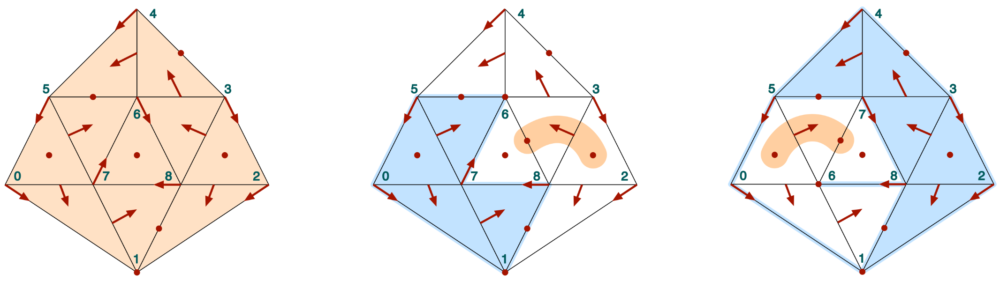
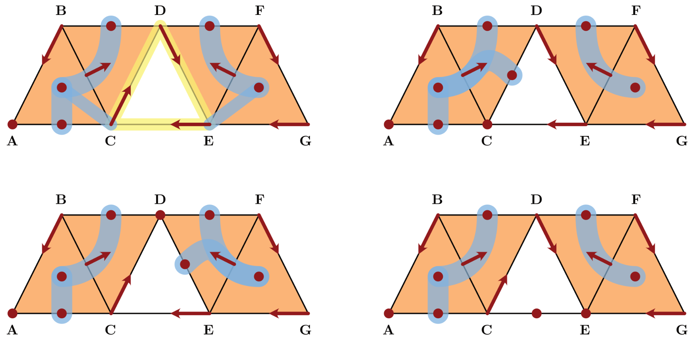

# Examples

```@meta
DocTestSetup = quote
    push!(LOAD_PATH,"../../../src/")
    using ConleyDynamics
end
```

In the following we discuss a number of connection matrix examples.

## Critical flow on a simplex

```@docs
example_critical_simplex(::Int)
```

## Combinatorial flows on a cylinder and a Moebius strip

```@docs
example_moebius()
```

## Nonunique connection matrices



```@docs
example_nonunique()
```

## Examples from MW-2023

The following examples are taken from the paper
*Connection matrices in combinatorial topological dynamics*
by Marian Mrozek & Thomas Wanner (*Preprint*, submitted for
publication, 115 pp, 2023).



```@docs
example_MW_fig02()
```

```@docs
example_MW_fig01()
example_MW_fig03()
example_MW_fig04()
example_MW_fig11()
```

## Examples from BKMW-2020

The following examples are taken from the paper *Linking combinatorial
and classical dynamics: Conley index and Morse decompositions* by
Bogdan Batko, Tomasz Kaczynski, Marian Mrozek, and Thomas Wanner
(*Foundations of Computational Mathematics* 20(5), pp. 967-1012, 2020).

```@docs
example_BKMW20_fig1()
example_BKMW20_fig3()
```

