# Examples

```@meta
DocTestSetup = quote
    push!(LOAD_PATH,"../../../src/")
    using ConleyDynamics
end
```

In order to illustrate the basic functionality of `ConleyDynamics.jl`, 
this section collects a number of examples. Many of these are taken 
from the papers [batko:etal:20a](@cite) and [mrozek:wanner:p21a](@cite),
and they consider both Forman vector fields and general multivector
fields on a variety of Lefschetz complexes. Each example has its own
associated function, so that users can quickly create examples
on their own by taking the respective source files as templates.

## The Multivector Field from the Logo

Our first example is taken from [mrozek:wanner:p21a; Figure 1](@cite),
and it is visualized in the accompanying figure.


Clearly, this is the multivector field from the `ConleyDynamics.jl`
logo. Since it was already discussed in detail in the [Tutorial](@ref),
we only show how the underlying simplicial complex and the multivector
field can be created quickly using the function [`example_MW_fig01`](@ref):

```@docs; canonical=false
example_MW_fig01()
```

The Morse sets and associated Conley indices can be accessed using
the commands:

```julia
julia> cm.morse
3-element Vector{Vector{String}}:
 ["D"]
 ["A", "B", "C", "AB", "AC", "BC", "BD", "CD", "BCD"]
 ["ABC"]

julia> cm.conley
3-element Vector{Vector{Int64}}:
 [1, 0, 0]
 [0, 1, 0]
 [0, 0, 1]
```

Notice that in this example, every simplex of the underlying
simplicial complex is contained in one of the Morse sets.

## Critical Flow on a Simplex

The next example considers the arguably simplest situation of a
Forman vector field on a simplicial complex. The simplicial complex
``X`` is given by a single simplex of dimension ``n``, together
with all its faces, while the Forman vector field on ``X`` contains
only singletons. In other words, every simplex in the complex
is a critical cell. Thus, this combinatorial dynamical system has
one equilibrium of index ``n``, and ``n+1`` stable equilibria. In
addition, there are ``2^{n+1} - n - 3`` additional stationary states
whose indices lie strictly between ``0`` and ``n``, as well as a 
wealth of algebraically induced heteroclinic orbits. All of these
can be found by using the connection matrix for the problem, as
outlined in the following description for the function
[`example_critical_simplex`](@ref).

```@docs; canonical=false
example_critical_simplex(::Int)
```

## Flow on a Cylinder and a Moebius Strip

The next example considers again Forman vector fields, but this
time on a cylinder and on a Moebius strip. The underlying simplicial
complexes are given by a horizontal strip of eight triangles, whose
left and right vertical edges are identified. For the first complex
`lc1` these edges are identified without twist, while for the
complex `lc2` they are twisted. See also the labels in the figure.

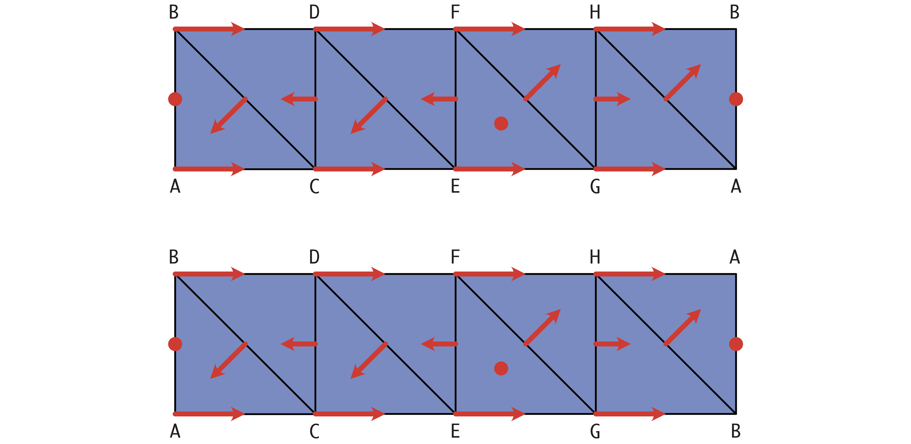

Both complexes consist of eight vertices, sixteen edges, and eight
triangles. The two complexes and Forman vector fields can be generated
using the function [`example_critical_simplex`](@ref), whose usage
can be described as follows.

```@docs; canonical=false
example_moebius
```

Note that for the combinatorial flow on the Moebius strip `lc2` the
choice of field characteristic ``p`` leads to potentially different 
connection matrices. While for characteristic ``p=2`` the connection
matrix has only one nontrivial entry, it has two for ``p=7``.

We only briefly include some sample computations for the latter case.
One can create the complexes, Forman vector fields, and associated
connection matrices for ``p=7`` using the following commands:

```julia
lc1, mvf1, lc2, mvf2 = example_moebius(7)
cm1 = connection_matrix(lc1,mvf1)
cm2 = connection_matrix(lc2,mvf2)
```

For the first example, the combinatorial flow on the cylinder has
four Morse sets. Two critical equilibria of indices 1 and 2, as well
as two periodic orbits. This can be shown as follows:

```julia
julia> cm1.morse
4-element Vector{Vector{String}}:
 ["A", "C", "E", "G", "AC", "AG", "CE", "EG"]
 ["B", "D", "F", "H", "BD", "BH", "DF", "FH"]
 ["AB"]
 ["EFG"]

julia> cm1.conley
4-element Vector{Vector{Int64}}:
 [1, 1, 0]
 [1, 1, 0]
 [0, 1, 0]
 [0, 0, 1]

julia> sparse_show(cm1.matrix)
[0   0   0   0   6   0]
[0   0   0   0   0   1]
[0   0   0   0   1   0]
[0   0   0   0   0   6]
[0   0   0   0   0   0]
[0   0   0   0   0   0]

julia> print(cm1.labels)
["A", "AG", "B", "BH", "AB", "EFG"]
```

In fact, the connection matrix implies the existence of
connecting orbits from both the index 2 and the index 1
equilibrium to the two periodic orbits. The connections
between the stationary states cannot be detected 
algebraically.

For the second example, the combinatorial flow on the
Moebius strip, one only obtains three Morse sets. This
time, there is only one periodic orbit which loops
around both the top and bottom edges in the figure.
This is confirmed by the commands

```julia
julia> cm2.morse
3-element Vector{Vector{String}}:
 ["A", "B", "C", "D", "E", "F", "G", "H", "AC", "AH", "BD", "BG", "CE", "DF", "EG", "FH"]
 ["AB"]
 ["EFG"]

julia> cm2.conley
3-element Vector{Vector{Int64}}:
 [1, 1, 0]
 [0, 1, 0]
 [0, 0, 1]

julia> sparse_show(cm2.matrix)
[0   0   0   0]
[0   0   0   1]
[0   0   0   2]
[0   0   0   0]

julia> print(cm2.labels)
["A", "BG", "AB", "EFG"]
```

In this case, the connection matrix is able to identify the
connecting orbits between the index 2 stationary state and
both the periodic orbit and the index 1 equilibrium. The 
latter one is not recognized over the field ``GF(2)``.

## Nonunique Connection Matrices

Our next example is concerned with another Forman vector field,
but this time on a larger simplicial complex, as shown in the
figure.

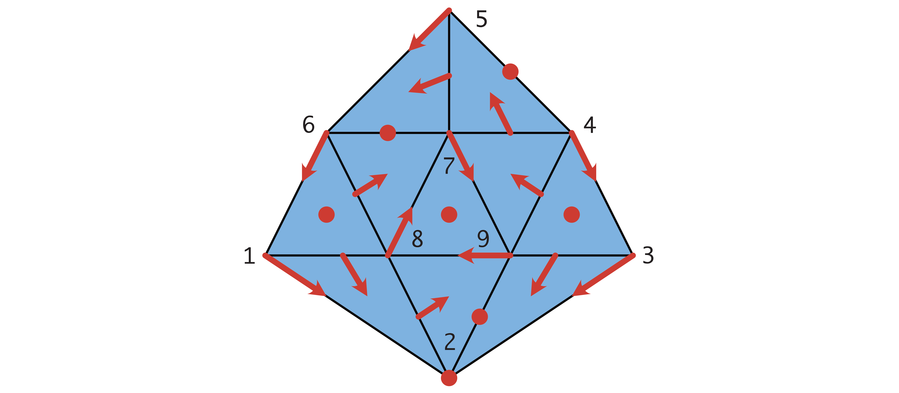

The simplicial complex is topologically a disk, and it consists
of 9 vertices, 18 edges, and 10 triangles. The Forman vector field
has 1 critical vertex, 3 critical edges, and 3 critical triangles,
as well as 15 Forman arrows. The following example shows that
for this combinatorial dynamical system, there are two fundamentally
different connection matrices.

```@docs; canonical=false
example_nonunique()
```

As mentioned in the docstring for the function [`example_nonunique`](@ref),
the two Lefschetz complexes `lc1` and `lc2` both represent the above
simplicial complex. However, they differ in the ordering of the vertex
labels. This can be seen from the commands

```julia
julia> print(lc1.labels[1:9])
["1", "2", "3", "4", "5", "6", "7", "8", "9"]
julia> print(lc2.labels[1:9])
["1", "2", "3", "4", "5", "6", "8", "9", "7"]
```

In other words, `lc1` and `lc2` are different representations of
the same complex. Nevertheless, computing the connection matrices
as in the example gives two distinct connection matrices. This is
purely a consequence of the different ordering of the rows and 
columns in the boundary matrix.

To shed further light on this issue, notice that the triangle
at the center of the complex forms an attracting periodic orbit, 
whose Conley index has Betti numbers 1 in dimensions 0 and 1.
One can break this periodic orbit by removing one of its three
arrows, and replacing it with two critical cells of dimensions
0 and 1. The next image shows two different ways of doing this.

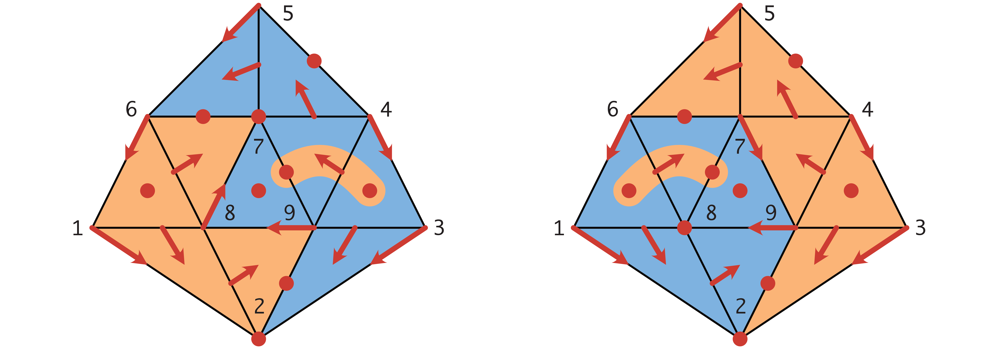

In the image on the left, the vector `["7", "79"]` is removed,
while the one on the right breaks up `["8", "78"]`. The corresponding
modified Forman vector fields, and their connection matrices, can be
created as follows:

```julia
mvf1 = deepcopy(mvf);
mvf2 = deepcopy(mvf);
deleteat!(mvf1,6);
deleteat!(mvf2,8);
cm1mod = connection_matrix(lc1, mvf1);
cm2mod = connection_matrix(lc2, mvf2);
```

Both of the new Forman vector fields are gradient vector fields, and
in view of a result in [mrozek:wanner:p21a](@cite), their connection
matrices are therefore uniquely determined. The connection matrix for
the vector field `mvf1` is of the form

```julia
julia> sparse_show(cm1mod.matrix)
[0   0   1   0   1   0   0   0   0]
[0   0   1   0   1   0   0   0   0]
[0   0   0   0   0   0   1   1   0]
[0   0   0   0   0   0   0   1   0]
[0   0   0   0   0   0   1   1   0]
[0   0   0   0   0   0   0   1   1]
[0   0   0   0   0   0   0   0   0]
[0   0   0   0   0   0   0   0   0]
[0   0   0   0   0   0   0   0   0]

julia> print(cm1mod.labels)
["2", "7", "29", "45", "67", "79", "168", "349", "789"]
```

Notice that this matrix shows that there is a connection from
the triangle `349` to the edge `79`, but there are no connections
from the triangle `168` to the critical edge on the center triangle.
In fact, up to reordering the columns and rows, this connection 
matrix is the same as `cm1` in the example.

Similarly, the connection matrix for the second modified Forman
vector field `mvf2` is uniquely determined, and it is given by

```julia
julia> sparse_show(cm2mod.matrix)
[0   0   1   0   1   0   0   0   0]
[0   0   1   0   1   0   0   0   0]
[0   0   0   0   0   0   1   1   0]
[0   0   0   0   0   0   0   1   0]
[0   0   0   0   0   0   1   1   0]
[0   0   0   0   0   0   1   0   1]
[0   0   0   0   0   0   0   0   0]
[0   0   0   0   0   0   0   0   0]
[0   0   0   0   0   0   0   0   0]

julia> print(cm2mod.labels)
["2", "8", "29", "45", "67", "78", "168", "349", "789"]
```

Now there is a connection from the triangle `168` to the edge `78`,
but there are no connections from the triangle `349` to the critical
edge on the center triangle. This time, up to a permutation of the
columns and the rows, this connection matrix is the same as `cm2`
in the example.

## Forcing Three Connection Matrices

The next example is taken from [mrozek:wanner:p21a; Figure 2](@cite),
and it revolves around the combinatorial vector field on a simplicial 
complex shown in the top left part of the figure.

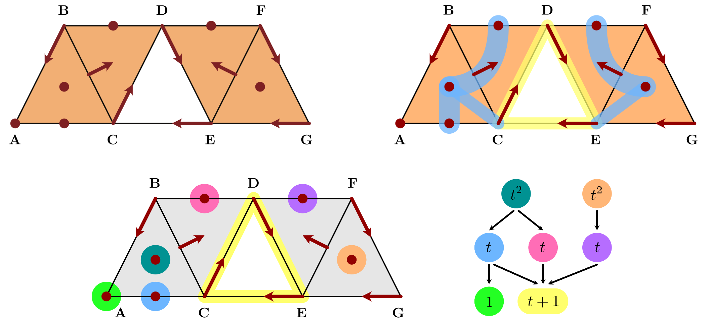

This combinatorial vector field is again of Forman type. It has 
a periodic orbit, which is shown in yellow in the top right part
of the figure. In addition to three index 1 equilibria, there are
two of index 2. The top right part shows that from these two index
2 cells there are a combined total of five connecting orbits to
the index 1 cells and to the periodic orbit. Its Morse decomposition
is shown in the lower part of the figure. While the Morse sets are
indicated by different colors, the Conley-Morse graph is shown on
the lower right.

As the following docstring for [`example_MW_fig02`](@ref) demonstrates,
the connection matrix, which this time is computed over the rationals
``\mathbb{Q}``, only identifies three of the five connecting orbits
between index 2 invariant sets and index 1 sets.

```@docs; canonical=false
example_MW_fig02()
```

It turns out that this combinatorial dynamical system has multiple
possible connection matrices as well. In fact, it has three. In order
to find them we use the same approach as in the last example, and 
break the periodic orbit by turning one of its arrows into two
critical cells. Since there are three arrows in the periodic 
orbit, this can be accomplished in three different ways. They
are indicated in the next figure.


The resulting Forman vector fields are all of gradient type, and
therefore have a unique connection matrix. These three vector
fields can be obtained via the function [`example_MW_fig02`](@ref)
by specifying the integer argument as `1`, `2`, or `3`. For the
first vector field one obtains the following connection matrix:

```julia
julia> lc1, mvf1 = example_MW_fig02(1);

julia> cm1 = connection_matrix(lc1, mvf1);

julia> print(cm1.labels)
["A", "C", "AC", "BD", "CD", "DF", "ABC", "EFG"]

julia> full_from_sparse(cm1.matrix)
8×8 Matrix{Rational{Int64}}:
 0  0  -1  -1  0  0   0  0
 0  0   1   1  0  0   0  0
 0  0   0   0  0  0  -1  0
 0  0   0   0  0  0   1  0
 0  0   0   0  0  0  -1  0
 0  0   0   0  0  0   0  1
 0  0   0   0  0  0   0  0
 0  0   0   0  0  0   0  0
```

In contrast, the second vector field leads to:

```julia
julia> lc2, mvf2 = example_MW_fig02(2);

julia> cm2 = connection_matrix(lc2, mvf2);

julia> print(cm2.labels)
["A", "D", "AC", "BD", "DE", "DF", "ABC", "EFG"]

julia> full_from_sparse(cm2.matrix)
8×8 Matrix{Rational{Int64}}:
 0  0  -1  -1  0  0   0   0
 0  0   1   1  0  0   0   0
 0  0   0   0  0  0  -1   0
 0  0   0   0  0  0   1   0
 0  0   0   0  0  0   0  -1
 0  0   0   0  0  0   0   1
 0  0   0   0  0  0   0   0
 0  0   0   0  0  0   0   0
```

Finally, the third gradient vector field gives:

```julia
julia> lc3, mvf3 = example_MW_fig02(3);

julia> cm3 = connection_matrix(lc3, mvf3);

julia> print(cm3.labels)
["A", "E", "AC", "BD", "CE", "DF", "ABC", "EFG"]

julia> full_from_sparse(cm3.matrix)
8×8 Matrix{Rational{Int64}}:
 0  0  -1  -1  0  0   0  0
 0  0   1   1  0  0   0  0
 0  0   0   0  0  0  -1  0
 0  0   0   0  0  0   1  0
 0  0   0   0  0  0   0  0
 0  0   0   0  0  0   0  1
 0  0   0   0  0  0   0  0
 0  0   0   0  0  0   0  0
```

This is finally the connection matrix that was originally returned
for the Forman vector field with periodic orbit. One could have
obtained the remaining two also through cell permutations.

Notice that these three matrices combined do identify all of the
above connections. It was shown in [mrozek:wanner:p21a](@cite)
that these matrices are different connection matrices for the
original Forman vector field with periodic orbit, as long as the
newly introduced index 1 and 0 equilibria are identified with the
Conley index of the periodic solution. For the sake of completeness,
the next figure shows the Morse decompositions for all three
combinatorial gradient flows. In the Conley-Morse graphs, blue
arrows correspond to the heteroclinic orbits that are identified
by the associated connection matrix.

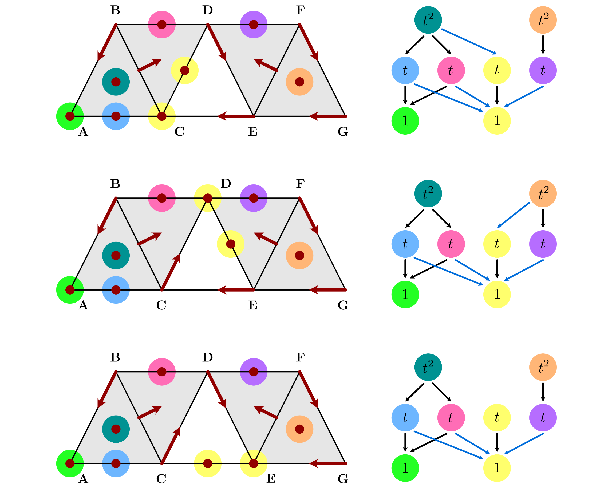

In the Conley-Morse graphs, we used the same color yellow for the
two Morse sets that are generated by breaking the periodic orbit
through the introduction of two critical cells. It can be seen
from the images that while the actual Morse set structure stays
fixed, the poset order in the Conley-Morse graphs changes from
case to case.

## A Lefschetz Multiflow Example

The next example is taken from [mrozek:wanner:p21a; Figure 3](@cite),
and it is a combinatorial multivector field on a true Lefschetz 
complex, as shown in the left panel of the associated figure.

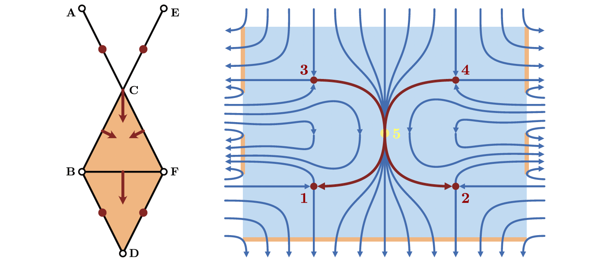

The example is a combinatorial representation of the multiflow shown
on the right, which features nonunique forward dynamics at the point
labeled ``5``. Note that the underlying Lefschetz complex is defined
as the subset of the depicted simplicial complex, where the vertices
``\mathrm{A}``, ``\mathrm{B}``, ``\mathrm{D}``, ``\mathrm{E}``, and
``\mathrm{F}`` have been removed. This Lefschetz complex `lc` and 
the depicted multivector field `mvf` can be created using the
function [`example_MW_fig03`](@ref):

```@docs; canonical=false
example_MW_fig03()
```

As the docstring shows, this example has a trivial connection
matrix. In other words, there are no connecting orbits in this
combinatorial dynamical system that are forced by topology.
In fact, one can easily see that due to the multivalued nature
of the dynamical system, one cannot expect any particular 
heteroclinic to be present.

The Morse decomposition of the system, and the associated 
Conley indices encompass precisely the four critical edges:

```julia
julia> cm.morse
4-element Vector{Vector{String}}:
 ["BD"]
 ["DF"]
 ["AC"]
 ["CE"]

julia> cm.conley
4-element Vector{Vector{Int64}}:
 [0, 1, 0]
 [0, 1, 0]
 [0, 1, 0]
 [0, 1, 0]
```

Combined with the fact that the connection matrix is trivial,
this means that the homology of the underlying Lefschetz
complex `lc` is the sum of the Conley indices of the Morse
sets. This can be confirmed using the function
[`homology`](@ref):

```julia
julia> homology(lc)
3-element Vector{Int64}:
 0
 4
 0
```

As we mentioned earlier, this is the same as the relative
homology of the full simplicial complex with respect to the
union of the five removed vertices.

## Small Complex with Periodicity

In [mrozek:wanner:p21a; Figure 4](@cite) we introduced a small
Lefschetz complex with periodic orbit and nonunique connection
matrices. This complex consists of one 2-cell, three 1-cells,
and two 0-cells, and it is shown in the leftmost panel of the
figure.

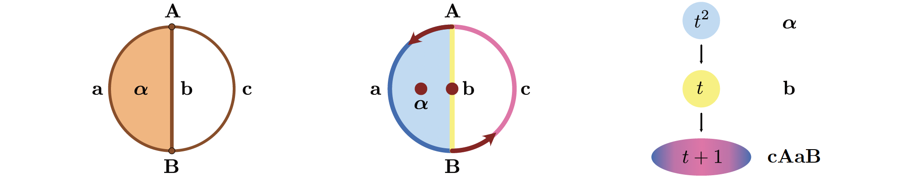

On the complex, consider the multivector field depicted
in the middle of the figure, which consists of the critical 
cells ``\alpha`` and ``b``, as well as the two regular multivectors
``\{ A, a \}`` and ``\{ B, c \}``. For this small example, one can
easily determine the Morse decomposition, and it is shown in the
rightmost panel. The example can be generated in `ConleyDynamics.jl`
using the function [`example_MW_fig04`](@ref):

```@docs; canonical=false
example_MW_fig04()
```

The function provides two different representations of the same
Lefschetz complex, which only differ in the ordering of the 1-cells.
This can be seen from the commands:

```julia
julia> print(lc1.labels)
["A", "B", "a", "b", "c", "alpha"]

julia> print(lc2.labels)
["A", "B", "c", "a", "b", "alpha"]
```

As the above docstring shows, these different versions lead to 
two different connection matrices `cm1` and `cm2`.

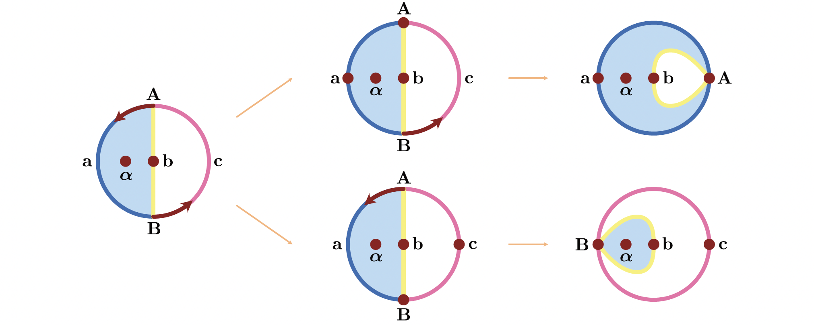

In this small example, one can easily determine the connection
matrices directly, as illustrated in the second figure. While
the detailed explanation can be found in [mrozek:wanner:p21a](@cite),
this is basically accomplished by contracting one of the two
regular multivectors. If one contracts ``\{ B, c \}``, then the
connection matrix `cm1` is obtained, while `cm2` is the result of
contracting ``\{ A, a \}``.

## Subdividing a Multivector

[mrozek:wanner:p21a; Figure 11](@cite)


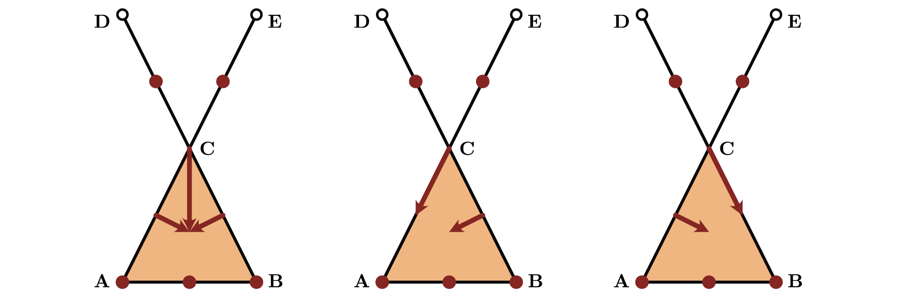


```@docs; canonical=false
example_MW_fig11()
```

## Forman Vector Field Examples

The following examples are taken from [batko:etal:20a](@cite).


[batko:etal:20a; Figure 1](@cite)


```@docs; canonical=false
example_BKMW20_fig1()
```

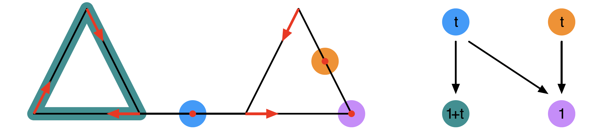


[batko:etal:20a; Figure 3](@cite)


```@docs; canonical=false
example_BKMW20_fig3()
```


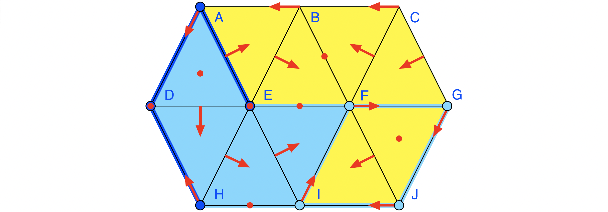


## [References](@id refexamples)

See the [full bibliography](@ref References) for a complete list
of references cited throughout this documentation. This section cites
the following references:

```@bibliography
Pages = ["examples.md"]
Canonical = false
```

