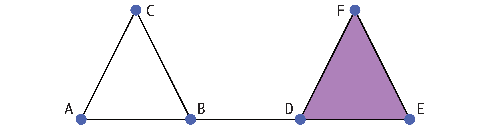
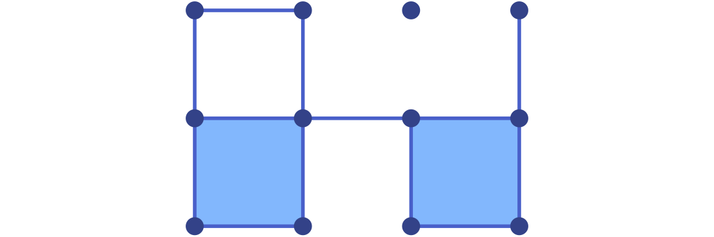

# Homology

Conley's theory for the qualitative study of dynamical systems is based
on fundamental concepts from algebraic topology. One of these is homology,
which studies the topological properties of spaces using algebraic means.
As part of `ConleyDynamics.jl` a number of homology methods are included.
It should be noted that these algorithms are not meant for truly large-scale
problems, but mostly for illustrative purposes. They are based on the
persistence algorithm described in [edelsbrunner:harer:10a](@cite), and
have been extended to work for arbitrary Lefschetz complexes over either
the rationals or a finite field of prime order. For more serious applications
one could use professional implementations such as *Gudhi*, see
[gudhi:24a](@cite).

## Lefschetz Complex Homology

The most important notion of homology used in `ConleyDynamics.jl` is 
*Lefschetz homology*. It generalizes both *simplicial homology* as 
described in [munkres:84a](@cite), and *cubical homology* in the sense
of [kaczynski:etal:04a](@cite). In order to fix our notation, we provide
a brief introduction in the following. For more details, see
[lefschetz:42a](@cite).

As we saw earlier, a Lefschetz complex ``X`` is a collection of cells
which associated nonnegative dimensions, together with a boundary map
``\partial`` which is induced by the incidence coefficient map ``\kappa``.
The fundamental idea behind homology is to turn this underlying information
into an algebraic form in such a way that the boundary map becomes a linear
map. For this, define the *``k``-th chain group* as

```math
   C_k(X) = \left\{ \sum_{i=1}^m \alpha_i \sigma_i \; : \;
   \alpha_1, \ldots, \alpha_m \in F \;\;\text{ and }\;\;
   \sigma_1, \ldots, \sigma_m \in X_k \right\} .
```

Since ``X_k`` denotes the collection of all cells of dimension
``k``, this definition can be rephrased by saying that ``C_k(X)`` consists
of all formal linear combinations of ``k``-dimensional cells with coefficients
in the underlying field ``F``. It is not difficult to see that ``C_k(X)`` is
in fact a vector space over ``F``. Moreover, its dimension is equal to the
number of ``k``-dimensional cells in ``X``. The collection of all chain
groups is ``C(X) = (C_k(X))_{k \in {\mathbb Z}}``, where we let
``C_k(X) = \{ 0 \}`` for all ``k < 0`` and ``k > \dim X``.

We now turn our attention to the boundary map. It was already explained how
the incidence coefficient map ``\kappa`` can be used to define a boundary
``\partial \sigma \in C_{k-1}(X)`` for every ``k``-dimensional cell
``\sigma \in X_k``. If one further defines

```math
   \partial \left( \sum_{i=1}^m \alpha_i \sigma_i \right) =
   \sum_{i=1}^m \alpha_i \partial\sigma_i \in C_{k-1}(X)
   \quad\text{ for }\quad
   \sum_{i=1}^m \alpha_i \sigma_i \in C_k(X) \; ,
```

then one obtains a map ``\partial : C_k(X) \to C_{k-1}(X)``. It is not 
difficult to verify that this map is both well-defined and linear.
Sometimes, we write ``\partial_k`` instead of ``\partial`` to emphasize
that we consider the boundary map defined on the ``k``-th chain group
``C_k(X)``.

Altogether, the above definitions have equipped us with a sequence
of vector spaces and maps between them in the form

```math
   \ldots \stackrel{\partial_{k+2}}{\longrightarrow}
   C_{k+1}(X) \stackrel{\partial_{k+1}}{\longrightarrow}
   C_{k}(X) \stackrel{\partial_{k}}{\longrightarrow}
   C_{k-1}(X) \stackrel{\partial_{k-1}}{\longrightarrow} \ldots
   \stackrel{\partial_{1}}{\longrightarrow}
   C_0(X) \stackrel{\partial_{0}}{\longrightarrow} \{ 0 \}
   \stackrel{\partial_{-1}}{\longrightarrow} \ldots ,
```

and the properties of a Lefschetz complex further imply that

```math
   \partial_k \circ \partial_{k+1} = 0
   \quad\text{ for all }\quad
   k \in {\mathbb Z} .
```

In other words, the pair ``(C(X), \partial)`` is a *chain complex*,
which consists of a sequence of vector spaces over ``F`` and linear
maps between them. Recall from linear algebra that any linear map
induces two important subspaces, which in the context of algebraic
topology are given special names as follows:

- The elements of the subspace ``Z_k(X) = \mathrm{ker}\;
  \partial_k`` are called the *``k``-cycles* of ``X``.
- The elements of the subspace ``B_k(X) = \mathrm{im}\;
  \partial_{k+1}`` are called the *``k``-boundaries* of ``X``.

Both of these vector spaces are subspaces of the ``k``-th chain
group ``C_k(X)``. Furthermore, in view of the above identity
``\partial_k \circ \partial_{k+1} = 0``, one immediately obtains
the subspace inclusion ``B_k(X) \subset Z_k(X)``. We can
therefore define the quotient space

```math
   H_k(X) \; = \;
   Z_k(X) / B_k(X) \; = \;
   \mathrm{ker}\;\partial_k / \mathrm{im}\;\partial_{k+1} .
```

This vector space is called the *``k``-th homology group* of the
Lefschetz complex ``X``. It is again a vector space over ``F``,
and therefore its dimension provides important information. In
view of this, the dimension of the ``k``-th homology group ``H_k(X)``
is called the *``k``-th Betti number of ``X``*, and abbreviated
as ``\beta_k = \dim H_k(X)``.

In order to shed some light on the actual meaning of homology,
and in particular the Betti numbers, we turn to an example.
Consider the simplicial complex `sc` that was already introduced
in the [Tutorial](@ref), and which can be created using the commands

```julia
labels = ["A","B","C","D","E","F"]
simplices = [["A","B"],["A","C"],["B","C"],["B","D"],["D","E","F"]]
sc = create_simplicial_complex(labels,simplices)
```

This two-dimensional simplicial complex is shown in the figure.



For simplicity, we consider the associated Lefschetz complex ``X``
over the field ``F = GF(2)``. Then chains in a chain group are just
a sum of individual cells of the same dimension.

In this simple example, one can determine the cycles and boundaries
for ``k=1`` directly. The vector space ``Z_1(X)`` of ``1``-cycles
contains the two nonzero chains
``c_1 = \mathrm{AB} + \mathrm{BC} + \mathrm{AC}`` and
``c_2 = \mathrm{DE} + \mathrm{EF} + \mathrm{DF}``,
since one can verify that ``\partial c_1 = \partial c_2 = 0``.
These are, however, not all nontrivial ``1``-cycles, since their sum
``c_1 + c_2`` is another one. Thus, the first cycle group is given by
``Z_1(X) = \{ 0, c_1, c_2, c_1 + c_2 \}``. It is a vector space over
``F = GF(2)`` of dimension two, and any two nonzero elements of
``Z_1(X)`` form a basis. What about the ``1``-boundaries? The
simplicial complex ``X`` contains only one ``2``-cell, namely
``\mathrm{DEF}``, and its boundary is given by the chain ``c_2``.
Thus, the first boundary group is given by ``B_1(X) = \{ 0, c_2 \}``,
which is a one-dimensional vector space over ``F``.

Combined, one can show that the first homology group ``H_1(X)``
consists of the two equivalence classes

```math
   H_1(X) = \left\{ B_1(X) , \; c_1 + B_1(X) \right\} \; ,
```

where the class ``B_1(X)`` is the zero element in ``H_1(X)``.
This implies that the first homology group is one-dimensional,
and we have ``\beta_1(X) = 1``. In some sense, the basis element
of ``H_1(X)``, which is the unique nonzero class given by
``c_1 + B_1(X)``, is *represented* by the cycle ``c_1``.

The above mathematically precise description can be summarized
as follows. All three cycles in ``Z_1(X)`` have the potential to
enclose holes in the simplicial complex ``X``, since they are
chains without boundary. However, some of these potential holes
have been filled in by two-dimensional cells. Thus, while
``c_1`` does indeed represent a hole in ``X``, the chain ``c_2``
does not, since its interior is filled in by ``\mathrm{DEF}``.
Note that the cycle ``c_1 + c_2`` does not create a second hole,
since we have ``(c_1 + c_2) - c_1 = c_2 \in B_1(X)``. In other
words, the first Betti number counts the number of independent
holes in the complex ``X``.

One can extend this discussion also to other dimensions and to
general Lefschetz complexes ``X``. In this way, one obtains the
following informal interpretations of the Betti numbers:

- ``\beta_0(X)`` counts the number of *connected components*
  of ``X``,
- ``\beta_1(X)`` counts the number of independent *holes* 
  in ``X``,
- ``\beta_2(X)`` counts the number of independent *cavities*
  in ``X``.

In general, one can show that ``\beta_k(X)`` represents the
number of independent ``(k+1)``-dimensional holes in the
Lefschetz complex ``X``. For more details, see [munkres:84a](@cite).


```julia
labels = ["A","B","C","D","E","F","G","H"]
simplices = [["A","B"],["A","F"],["B","F"],["B","C","G"],["D","E","H"],["C","D"],["G","H"]]
sc = create_simplicial_complex(labels,simplices)
```


```julia
cubes = ["00.11", "01.01", "02.10", "11.10", "11.01", "22.00", "20.11", "31.01"]
cc = create_cubical_complex(cubes)
```





## Relative Homology


## Persistent Homology

[dlotko:wanner:16a](@cite)
[dlotko:wanner:18a](@cite)
[gameiro:etal:05a](@cite)
[edelsbrunner:harer:10a](@cite)


## [References](@id refhomology)

See the [full bibliography](@ref References) for a complete list
of references cited throughout this documentation. This section cites
the following references:

```@bibliography
Pages = ["homology.md"]
Canonical = false
```

