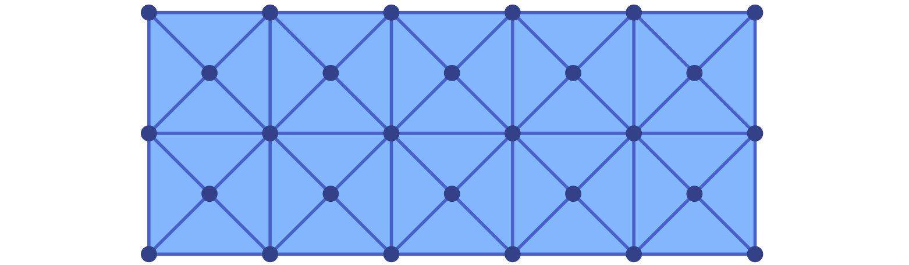

# Lefschetz Complexes

The fundamental structure underlying the functionality of `ConleyDynamics.jl` is
a *Lefschetz complex*. It provides us with the basic model of phase space for
combinatorial topological dynamics. In view of the combinatorial, and therefore
discrete, character of the dynamical behavior, a Lefschetz complex is not a
typical phase space in the sense of classical dynamics. While the latter one
is usually a Euclidean space, a Lefschetz complex is basically a combinatorial
model of it. In the following fairly mathematical discussion, we provide its
precise mathematical definition, and explain how it can be created and modified
within the package. We also discuss two important special cases, namely
*simplicial complexes* and *cubical complexes*.

## Basic Lefschetz Terminology

The original definition of a Lefschetz complex can be found in
[lefschetz:42a](@cite), where it was simply referred to as a *complex*.

!!! tip "Definition: Lefschetz complex"
    Let ``F`` denote an arbitrary field. Then a pair ``(X,\kappa)``
    is called a *Lefschetz complex* over ``F`` if
    ``X = (X_k)_{k \in \mathbb{N}_0}`` is a finite set with
    ``\mathbb{N}_0``-gradation, and ``\kappa : X \times X \to F``
    is a mapping such that
    ```math
       \kappa(x,y) \neq 0
       \quad\mathrm{ implies }\quad
       x \in X_k
       \quad\mathrm{ and }\quad y \in X_{k-1},
    ```
    and such that for any ``x,z \in X`` one has
    ```math
       \sum_{y \in X} \kappa(x,y) \kappa(y,z) = 0 \; .
    ```
    The elements of ``X`` are referred to as *cells*, the
    value ``\kappa(x,y) \in F`` is called the *incidence coefficient*
    of the cells ``x`` and ``y``, and the map ``\kappa`` is the
    *incidence coefficient map*. In addition, one defines the
    *dimension* of a cell ``x\in X_k`` as the integer ``k``, and
    denotes it by ``k = \dim x``. Whenever the incidence coefficient
    map is clear from context, we often just refer to ``X`` as the
    *Lefschetz complex*.

At first glance the above definition can seem daunting. However,
it is based on a straightforward geometric idea. A Lefschetz 
complex is a structure that is built from elementary building
blocks called *cells*. Each cell has a dimension associated with
it, and it is topologically an open ball of this dimension. Thus,
cells of dimension zero are points, also called *vertices*. Cells
of dimension one are open curve segments, which we call *edges*,
and two-dimensional cells are called *faces* and take the form
of open two-dimensional membranes.

The incidence coefficient map encodes how these cells are glued
together to form the Lefschetz complex ``X``. In order to shed
more light on this, consider the *boundary map* ``\partial``
which is defined on cells via

```math
   \partial x = \sum_{y \in X} \kappa(x,y) y \; .
```

This map sends a cell ``x`` of dimension ``k`` to a specific 
linear combination of cells of dimension ``k-1``, called the
*boundary* of ``x``. By using ideas from linear algebra, the
boundary map can be extended to map a general linear combination
of ``k``-dimensional cells to the corresponding linear combination
of the separate boundaries. For example, if one chooses the field
``F = \mathbb{Q}`` of rationals, one has ``\partial  (x_1 - 2x_2)
= \partial x_1 - 2 \partial x_2``. Notice that using this extended
definition of the boundary map, one can rewrite the summation
condition in the definition of a Lefschetz complex in the
equivalent form

```math
   \partial( \partial x) = 0
   \quad\text{ for all cells }\quad
   x \in X \; .
```

In other words, the boundary of any cell is itself boundaryless.

With the help of the boundary map, one can often infer the
overall geometric structure of a Lefschetz complex ``X``. For this,
think of a Lefschetz complex as being build *from the ground up* in
the following way. First, start by putting down all vertices of ``X``
at different locations in some ambient space. Since the boundary of
each one-dimensional cell is made up of a linear combination of
vertices, one can then add a curve segment for each one-dimensional
cell, which connects the vertices in its boundary. Note that in the
general version of a Lefschetz complex it is possible that an edge
has only one vertex in its boundary, or maybe even none, and in these
cases the edge is either only connected to the one boundary vertex,
or it is an open curve segment connected to no vertex at all,
respectively. Continue in this fashion to add two-dimensional
faces to fill in the space between the edges in its boundary,
and so on for higher dimensions. Needless to say, in the case
of a general complicated Lefschetz complex this procedure is
of limited use, since the boundary of a cell can be an arbitrary
linear combination of cells, with coefficients that can be any
nonzero numbers in the field ``F``. Yet, in many simple cases
the above intuition is sufficient.

In addition to the above definitions, there are a handful of other
concepts which will be important for our discussion of Lefschetz
complexes. Specifically, the following notions are important:

- A *facet* of a cell ``x \in X`` is any cell ``y`` which satisfies
  ``\kappa(x,y) \neq 0``.
- One can define a partial order on the cells of ``X`` by letting
  ``x \le y`` if and only if for some integer ``n \in \mathbb{N}``
  there exist cells ``x = x_1, \ldots, x_n = y`` such that ``x_k``
  is a facet of ``x_{k+1}`` for all ``k = 1, \ldots, n-1``.
  It is not difficult to show that this defines a partial order on
  ``X``, i.e., this relation is reflexive, antisymmetric, and
  transitive. We call this partial order the *face relation*. 
  Moreover, if ``x \le y`` then ``x`` is called a *face* of ``y``.
- A subset ``C \subset X`` of a Lefschetz complex is called *closed*,
  if for every ``x \in C`` all the faces of the cell ``x`` are also
  contained in the subset ``C``.
- The *closure* of a subset ``C \subset X`` is the collection of all
  faces of all cells in ``C``, and it is denoted by ``\mathrm{cl}\, C``.
  Thus, a subset of a Lefschetz complex is closed if and only if it
  equals its closure.
- A subset ``S \subset X`` is called *locally closed*, if its *mouth*
  ``\mathrm{mo}\, S = \mathrm{cl}\, S \setminus S`` is closed. Note
  that every closed set is automatically locally closed, but the
  reverse implication is usually false.

While the first two points merely introduce notation for describing
the combinatorial boundary of cells, the remaining three points establish
important *topological concepts*. In fact, the above definition of
closedness defines a topology on the Lefschetz complex ``X``, which
is the so-called *Alexandrov topology* from [alexandrov:37a](@cite).
As usual in the field of topology, a subset of a Lefschetz complex
will be called *open*, if and only if its complement is closed.

We would like to point out that while the concept of local closedness
is rarely considered in standard topology courses, it is of utmost important
for the study of combinatorial topological dynamics. For the moment, we
just mention the following result:

!!! danger "Theorem: Lefschetz subcomplexes"
    Let ``X`` be a Lefschetz complex over a field ``F``, and let
    ``\kappa : X \times X \to F`` denote its incidence coefficient
    map. Then a subset ``S \subset X`` is again a Lefschetz complex,
    with respect to the restriction of ``\kappa`` to ``S \times S``,
    if and only if the subset ``S`` is locally closed.

This result goes back to [mrozek:batko:09a; Theorem 3.1](@cite), where
it was shown that local closedness is sufficient. In other words, in the
category of Lefschetz complexes local closedness arises naturally. Due
to its importance, we also mention the following two equivalent
formulations:

- A subset ``S \subset X`` is locally closed, if and only if it is the
  difference of two closed subsets of ``X``.
- A subset ``S \subset X`` is locally closed, if and only if it is an
  interval with respect to the face relation on ``X``, i.e., whenever
  we have three cells with ``S \ni x \le y \le z \in S``, then one
  has to have ``y \in S`` as well.

The proof of these characterizations can be found in
[mrozek:wanner:p21a; Proposition 3.2](@cite) and
[lipinski:etal:23a; Proposition 3.10](@cite), respectively.

Lefschetz complexes are a very general mathematical concept, and they
can be rather confusing at first sight. Nevertheless, they do encompass
other complex types, which are more geometric in nature. As we already
saw in the tutorial, every *simplicial complex* is automatically a
Lefschetz complex, and we will further ellaborate on this connection
below. In addition, we will also demonstrate that *cubical complexes*
are Lefschetz complexes. More general, any *regular CW complex* is 
a Lefschetz complex as well. For more details on this, we refer to
the definition in [massey:91a](@cite) and the discussion in
[dlotko:etal:11a](@cite).

## Lefschetz Complex Data Structure

For the efficient and easy manipulation of Lefschetz complexes
in `ConleyDynamics.jl` we make use of a specific composite
data type:

```@docs; canonical=false
LefschetzComplex
```

The fields of this struct relate to the mathematical definition
of a Lefschetz complex ``X`` in the following way:

- The integer `ncells` gives the total number of cells in ``X``.
  Internally, these cells are numbered by integers ranging from `1`
  to `ncells`.
- The vector `dimensions` is a `Vector{Int}` and collects the 
  dimensions of the cells. In other words, the cell which is indexed
  by the integer `k` has dimension `dimensions[k]`.
- The integer `dim` describes the overall dimension of the Lefschetz
  complex, which is the largest dimension of a cell.
- The incidence coefficient map ``\kappa`` is encoded in the sparse
  matrix `boundary`. This matrix is a square matrix with `ncells` 
  rows and columns. The ``k``-th column contains the incidence
  coefficients ``\kappa(k,\cdot)`` in the sense that the entry
  in row ``m`` and column ``k`` equals the value ``\kappa(k,m)``.
  Since for most Lefschetz complexes the majority of the incidence
  coefficients is zero, the matrix is represented using the sparse
  format [`SparseMatrix`](@ref), which is described in more detail
  in [Sparse Matrices](@ref).
- While the internal representation of cells as integers is 
  computationally convenient, it does make interpreting the
  results more difficult. Each Lefschetz complex therefore has
  to have string labels assigned to each cell as well. These are
  contained in `labels::Vector{String}`, where `labels[k]` gives
  the label of cell `k`.
- In order to easily determine the integer index for a cell with
  a specific label, the field `indices` contains a dictionary
  of type `Dict{String,Int}` which maps labels to indices. For 
  example, if a cell has the label `"124.010"`, then the associated
  integer index is given by `indices["124.010"]`.

An object of type `LefschetzComplex` is created by passing the
field items in the order given in [`LefschetzComplex`](@ref).
Consider for example the Lefschetz complex from Figure 4
in [mrozek:wanner:p21a](@cite), see also the left complex in the
next image. This complex consists of six cells with labels `A`, 
`B`, `a`, `b`, `c`, and `alpha`, and we initialize the vector of
labels, the cell index dictionary, and the cell dimensions via
the commands

```julia
ncL = 6
labelsL  = Vector{String}(["A","B","a","b","c","alpha"])
indicesL = Dict{String,Int}([(labelsL[k],k) for k in 1:length(labelsL)])
cdimsL   = [0, 0, 1, 1, 1, 2]
```

The boundary matrix can then be defined using

```julia
bndmatrixL = zeros(Int, ncL, ncL)
bndmatrixL[[1,2],3] = [1; 1]     # a
bndmatrixL[[1,2],4] = [1; 1]     # b
bndmatrixL[[1,2],5] = [1; 1]     # c
bndmatrixL[[3,4],6] = [1; 1]     # alpha
bndsparseL = sparse_from_full(bndmatrixL, p=2)
```

Notice that we first create the matrix as a regular integer 
matrix, and then use the function [`sparse_from_full`](@ref) 
to turn it into sparse format over the field ``GF(2)`` with
characteristic `p = 2`. Finally, the Lefschetz complex is
created using

```julia
lcL = LefschetzComplex(ncL, 2, bndsparseL, labelsL, indicesL, cdimsL)
```


Lefschetz complexes do not always have to contain cells of
all dimensions. For example, the Lefschetz complex shown on the
right side of the figure has no vertices, and it can be created
using the commands

```julia
ncR = 4
labelsR  = Vector{String}(["a","b","c","alpha"])
indicesR = Dict{String,Int}([(labelsR[k],k) for k in 1:length(labelsR)])
cdimsR   = [1, 1, 1, 2]
bndmatrixR = zeros(Int, ncR, ncR)
bndmatrixR[[1,2,3],4] = [1; 1; 1]     # alpha
bndsparseR = sparse_from_full(bndmatrixR, p=2)
lcR = LefschetzComplex(ncR, 2, bndsparseR, labelsR, indicesR, cdimsR)
```

While Lefschetz complexes can always be created in `ConleyDynamics.jl`
in this direct way, it is often more convenient to make use of special
types, such as simplicial and cubical complexes, and then restrict the
complex to a locally closed set. This is described in more detail below.

## Simplicial Complexes

One of the earliest types of complexes that have been studied in 
topology are *simplicial complexes*. As already mentioned in the
tutorial, an *abstract simplicial complex* ``X`` is a finite collection
of finite sets, called *simplices*, which is closed under taking subsets.
Each simplex ``\sigma`` has a *dimension* ``\dim\sigma``, which is one
less than the number of its elements.

In order to see why every simplicial complex is automatically a 
Lefschetz complex, we need to be able to define the incidence 
coefficient map ``\kappa``. For this, we make use of some notions
from [munkres:84a](@cite). Let ``X_0`` denote the collection of all
vertices of the simplicial complex ``X``. Then we use the notation

```math
   \sigma = \left[ v_0, v_1, \ldots, v_d \right]
   \quad\text{ with }\quad
   v_k \in X_0
```

to describe a ``d``-dimensional simplex. Note that even though every
simplex in ``X`` is just the set of its vertices, in the above 
representation we pick an order of the vertices, called an *orientation*
of the simplex. This orientation can be chosen arbitrarily, and there
are two equivalence classes of orientations. To get from one orientation
to the other, one just has to exchange two vertices, and we write

```math
   \left[ \ldots, v_i, \ldots, v_j, \ldots \right] \; = \;
   -\left[ \ldots, v_j, \ldots, v_i, \ldots \right] \; .
```

For more complicated reorderings, one has to represent the
corrresponding vertex permutation as a sequence of such exchanges.
Using these oriented simplices we can define the boundary operator

```math
   \partial \sigma \; = \;
   \partial \left[ v_0, \ldots, v_d \right] \; = \;
   \sum_{i=0}^d (-1)^i \left[ v_0, \ldots, \hat{v}_i,
     \ldots, v_d \right] \; ,
```

where the notation ``\hat{v}_i`` means that in the simplex behind
the summation sign on the right-hand side the vertex ``v_i`` is
omitted. For example, for a two-dimensional simplex one obtains

```math
   \partial \left[ v_0, v_1, v_2 \right] \; = \;
   \left[ v_1, v_2 \right] - 
   \left[ v_0, v_2 \right] + 
   \left[ v_0, v_1 \right] \; .
```

Thus, if one chooses a consistent order of all the vertices in the
simplicial complex, and orients the simplices in such a way that 
its vertices are ordered in the same way, then the incidence 
coefficient map is given by

```math
   \kappa \left( \left[ v_0, \ldots, v_i, \ldots, v_d \right], \;
     \left[ v_0, \ldots, \hat{v}_i, \ldots, v_d \right] \right)
   \; = \; (-1)^i \; .
```

If some or all of the simplices are represented by different orientations,
one simply has to multiply the value ``(-1)^i`` by the sign of a suitable
vertex permutation. In either case, the so-defined map ``\kappa`` does
indeed satisfy the definition of a Lefschetz complex. For more details,
see [munkres:84a; Lemma 5.3](@cite).

In `ConleyDynamics.jl` there are three basic commands for defining
a simplicial complex:

- [`create_simplicial_complex`](@ref) is the most general method, and it
  expects two input arguments. The first is usually called `labels`, and 
  it has to have the data type `Vector{String}`. This vector lists the
  labels for each vertex. It is important that all of these labels have
  exactly the same number of characters. The second argument is usually
  called `simplices`, and it lists as many simplices as necessary for
  defining the underlying simplicial complex. This means that in practice
  one only needs to include the simplices which are not faces of
  higher-dimensional ones, see also the example below. The variable
  `simplices` can either be of type `Vector{Vector{String}}` or
  `Vector{Vector{Int}}`, depending on whether the vertices are identified
  via their labels or integer indices, respectively. Finally, the optional
  parameter `p` can be used to specify the underlying field for the 
  boundary matrix. If `p` is a prime, then ``F = GF(p)``, while for
  `p = 0` the function uses ``F = \mathbb{Q}``. If the argument `p`
  is ommitted, the function defaults to `p = 2`.
- [`create_simplicial_rectangle`](@ref) expects two integer arguments
  `nx` and `ny`, and then creates a triangulation of the square
  ``[0,nx] \times [0,ny]`` by subdividing every unit square into
  four triangles which meet at the center of the square. As before,
  the optional parameter `p` specifies the underlying field.
- [`create_simplicial_delaunay`](@ref) creates a planar Delaunay
  triangulation inside a planar rectangle. The function selects a
  random sample of points inside the box, while either trying to
  maintain a minimum distance between the points, or just using a
  prespecified number of points. More details on these two options
  can be found in the documentation for the function.

To illustrate the first of these functions, consider the commands

```julia
labels = ["A","B","C","D","E","F","G","H"]
simplices = [["A","B"],["A","F"],["B","F"],["B","C","G"],["D","E","H"],["C","D"],["G","H"]]
sc = create_simplicial_complex(labels,simplices)
```

These create the simplicial complex `sc`, in the form of a  Lefschetz
complex. It can be visualized using the commands

```julia
coords = [[0,0],[2,0],[4,0],[6,0],[8,0],[1,2],[4,2],[6,2]]
ldir   = [3,3,3,3,3,1,1,1]
fname  = "lefschetzex2.pdf"
plot_planar_simplicial(sc,coords,fname,labeldir=ldir,labeldis=10,hfac=2,vfac=1.5,sfac=50)
```


Similarly, the commands

```julia
sc2, coords2 = create_simplicial_rectangle(5,2)
fname2 = "lefschetzex3.pdf"
plot_planar_simplicial(sc2,coords2,fname2,hfac=2.0,vfac=1.2,sfac=75)
```

define and illustrate a second simplicial complex.



For a demonstration of the Delaunay triangulation approach,
please see [Analyzing Planar Vector Fields](@ref).

## Cubical Complexes


[kaczynski:etal:04a](@cite)


- [`create_cubical_complex`](@ref)
- [`create_cubical_rectangle`](@ref)
- [`create_cubical_box`](@ref)
- [`cube_field_size`](@ref)
- [`cube_information`](@ref)
- [`cube_label`](@ref)


## Lefschetz Complex Operations

Once a Lefschetz complex has been created, there are a number
of manipulations and queries that one would like to be able to
perform on the comlex. At the moment, `ConleyDynamics.jl` provides
a number of functions for this. The following three functions 
provide *basic information*:

- [`lefschetz_field`](@ref) returns the field ``F`` over which the
  Lefschetz complex is defined as a `String`.
- [`lefschetz_is_closed`](@ref) checks whether a given Lefschetz
  complex cell subset is closed or not.
- [`lefschetz_is_locally_closed`](@ref) determines whether a given
  Lefschetz complex cell subset is closed or not.

The next set of functions can be used to extract certain *topological
features* from a Lefschetz complex:

- [`lefschetz_boundary`](@ref) computes the support of the boundary
  ``\partial\sigma`` of a Lefschetz complex cell ``\sigma``. In
  other words, it returns the vector of all facets of ``\sigma``.
  The cell can either be specified via its index or its label,
  and the return format corresponds to the input format.
- [`lefschetz_coboundary`](@ref) returns all cells which lie
  in the coboundary of the specified cell ``\sigma``, i.e., it
  returns all cells which have ``\sigma`` as a facet.
- [`lefschetz_closure`](@ref) determines the closure of a 
  given cell subset, i.e., the union of all faces of cells
  in the cell subset.
- [`lefschetz_openhull`](@ref) computes the open hull of a
  cell subset, i.e., the smallest open set which contains
  the given cell subset.
- [`lefschetz_lchull`](@ref) finds the locally closed hull of a
  Lefschetz complex subset. This is the smallest locally closed
  set which contains the given cell subset. One can show, that 
  it is the intersection of the closure and the open hull of the
  cell subset.
- [`lefschetz_clomo_pair`](@ref) determines the closure-mouth-pair
  associated with a Lefschetz complex subset.
- [`lefschetz_skeleton`](@ref) computes the ``k``-dimensional
  skeleton of a Lefschetz complex or of a given Lefschetz complex
  subset. While in the first case the ``k``-skeleton of the full
  Lefschetz complex is returned, in the second case it returns the
  ``k``-skeleton of the closure of the given subset.
- [`manifold_boundary`](@ref) returns a list of cells which form
  the "manifold boundary" of the given Lefschetz complex. More 
  precisely, if the complex has dimension ``d``, then it returns
  all cells of dimension ``d-1`` which have at most one cell in
  their coboundary, as well as all cells of dimensions less
  than ``d-1``.

The following functions *Lefschetz subcomplexes* from a Lefschetz
complex:

- [`lefschetz_subcomplex`](@ref) determines a Lefschetz subcomplex
  from a given Lefschetz complex. The subcomplex has to be locally
  closed, and it is given by the collection of cell subsets.
- [`lefschetz_closed_subcomplex`](@ref) extracts a closed Lefschetz
  subcomplex from the given Lefschetz complex. The subcomplex is the
  closure of the specified collection of cell subsets.
- [`permute_lefschetz_complex`](@ref) determines a new Lefschetz
  complex which is obtained from the original by a permutation
  of the cells.

There are also two *helper functions* which can sometimes 
be useful:

- [`lefschetz_gfp_conversion`](@ref) changes the base field
  of the given Lefschetz complex from the rationals
  ``\mathbb{Q}`` to a finite field ``GF(p)``. Note that it
  is not possible to perform the reverse conversion.
- [`lefschetz_filtration`](@ref) computes a filtration on a
  Lefschetz subset. Based on integer filtration values assigned
  to some cells of the given Lefschetz complex, it determines
  the smallest closed subcomplex `lcsub` which contains all
  cells with nonzero filtration values, as well as filtration
  values `fvalsub` on this subcomplex, which gives rise to
  a filtration of closed subcomplexes, and which can be used
  to compute persistent homology.

In addition, `ConleyDynamics.jl` provides the following helper
functions for the fundamental objects of *cells and cell subsets*,
which can be represented either by integer cell indices or by
cell labels:

- [`convert_cells`](@ref) converts a vector of cells from
  integer to label format, or vice versa.
- [`convert_cellsubsets`](@ref) converts a vector of cell
  subsets from integer to label format, and vice versa.

Finally, there are a couple of *ccordinate helper functions*
which allow for the transformation of vertex coordinates
in a Lefschetz complex:

- [`convert_planar_coordinates`](@ref)
- [`convert_spatial_coordinates`](@ref)

For more details on the usage of any of these functions, please
see their documentation in the API section of the manual. 

## [References](@id reflefschetz)

See the [full bibliography](@ref References) for a complete list
of references cited throughout this documentation. This section cites
the following references:

```@bibliography
Pages = ["lefschetz.md"]
Canonical = false
```

