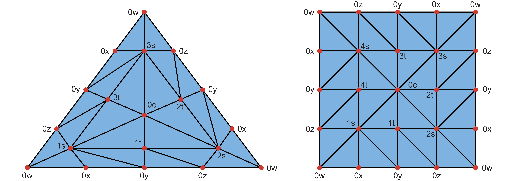
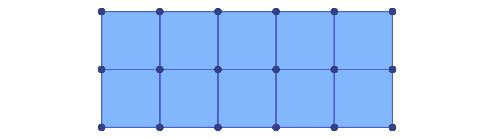
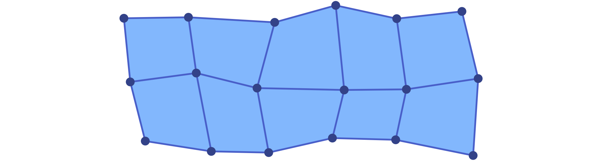

# Lefschetz Complexes

The fundamental structure underlying the functionality of
[ConleyDynamics.jl](https://almost6heads.github.io/ConleyDynamics.jl) is
a *Lefschetz complex*. It provides us with the basic model of phase space for
combinatorial topological dynamics. In view of the combinatorial, and therefore
discrete, character of the dynamical behavior, a Lefschetz complex is not a
typical phase space in the sense of classical dynamics. While the latter one
is usually a Euclidean space, a Lefschetz complex is basically a combinatorial
model of it. In the following, we provide its precise mathematical definition,
and explain how it can be created and modified within the package. We also
discuss two important special cases, namely *simplicial complexes* and
*cubical complexes*.

## Basic Lefschetz Terminology

The original definition of a Lefschetz complex can be found in
[lefschetz:42a](@cite), where it was simply referred to as a *complex*.

!!! tip "Definition: Lefschetz complex"
    Let ``F`` denote an arbitrary field. Then a pair ``(X,\kappa)``
    is called a *Lefschetz complex* over ``F`` if
    ``X = (X_k)_{k \in \mathbb{N}_0}`` is a finite set with
    ``\mathbb{N}_0``-gradation, and ``\kappa : X \times X \to F``
    is a mapping such that
    ```math
       \kappa(x,y) \neq 0
       \quad\mathrm{ implies }\quad
       x \in X_k
       \quad\mathrm{ and }\quad y \in X_{k-1},
    ```
    and such that for any ``x,z \in X`` one has
    ```math
       \sum_{y \in X} \kappa(x,y) \kappa(y,z) = 0 \; .
    ```
    The elements of ``X`` are referred to as *cells*, the
    value ``\kappa(x,y) \in F`` is called the *incidence coefficient*
    of the cells ``x`` and ``y``, and the map ``\kappa`` is the
    *incidence coefficient map*. In addition, one defines the
    *dimension* of a cell ``x\in X_k`` as the integer ``k``, and
    denotes it by ``k = \dim x``. Whenever the incidence coefficient
    map is clear from context, we often just refer to ``X`` as the
    *Lefschetz complex*.

At first glance the above definition can seem daunting. However,
it is based on a straightforward geometric idea. A Lefschetz 
complex is a structure that is built from elementary building
blocks called *cells*. Each cell has a dimension associated with
it, and it is topologically an open ball of this dimension. Thus,
cells of dimension zero are points, also called *vertices*. Cells
of dimension one are open curve segments, which we call *edges*,
and two-dimensional cells are called *faces* and take the form
of open two-dimensional membranes.

The incidence coefficient map encodes how these cells are glued
together to form the Lefschetz complex ``X``. In order to shed
more light on this, consider the *boundary map* ``\partial``
which is defined on cells via

```math
   \partial x = \sum_{y \in X} \kappa(x,y) y \; .
```

This map sends a cell ``x`` of dimension ``k`` to a specific 
linear combination of cells of dimension ``k-1``, called the
*boundary* of ``x``. By using ideas from linear algebra, the
boundary map can be extended to map a general linear combination
of ``k``-dimensional cells to the corresponding linear combination
of the separate boundaries. For example, if one chooses the field
``F = \mathbb{Q}`` of rationals, one has ``\partial  (x_1 - 2x_2)
= \partial x_1 - 2 \partial x_2``. Notice that using this extended
definition of the boundary map, one can rewrite the summation
condition in the definition of a Lefschetz complex in the
equivalent form

```math
   \partial( \partial x) = 0
   \quad\text{ for all cells }\quad
   x \in X \; .
```

In other words, the boundary of any cell is itself boundaryless.

With the help of the boundary map, one can often infer the
overall geometric structure of a Lefschetz complex ``X``. For this,
think of a Lefschetz complex as being build *from the ground up* in
the following way. First, start by putting down all vertices of ``X``
at different locations in some ambient space. Since the boundary of
each one-dimensional cell is made up of a linear combination of
vertices, one can then add a curve segment for each one-dimensional
cell, which connects the vertices in its boundary. Note that in the
general version of a Lefschetz complex it is possible that an edge
has only one vertex in its boundary, or maybe even none, and in these
cases the edge is either only connected to the one boundary vertex,
or it is an open curve segment connected to no vertex at all,
respectively. Continue in this fashion to add two-dimensional
faces to fill in the space between the edges in its boundary,
and so on for higher dimensions. Needless to say, in the case
of a general complicated Lefschetz complex this procedure is
of limited use, since the boundary of a cell can be an arbitrary
linear combination of cells, with coefficients that can be any
nonzero numbers in the field ``F``. Yet, in many simple cases
the above intuition is sufficient.

In addition to the Lefschetz complex definition, there are
a handful of other concepts which will be important for our
discussion of Lefschetz complexes. Specifically, the following
notions are important:

- A *facet* of a cell ``x \in X`` is any cell ``y`` which satisfies
  ``\kappa(x,y) \neq 0``.
- One can define a partial order on the cells of ``X`` by letting
  ``x \le y`` if and only if for some integer ``n \in \mathbb{N}``
  there exist cells ``x = x_1, \ldots, x_n = y`` such that ``x_k``
  is a facet of ``x_{k+1}`` for all ``k = 1, \ldots, n-1``.
  It is not difficult to show that this defines a partial order on
  ``X``, i.e., this relation is reflexive, antisymmetric, and
  transitive. We call this partial order the *face relation*. 
  Moreover, if ``x \le y`` then ``x`` is called a *face* of ``y``.
- A subset ``C \subset X`` of a Lefschetz complex is called *closed*,
  if for every ``x \in C`` all the faces of the cell ``x`` are also
  contained in the subset ``C``.
- The *closure* of a subset ``C \subset X`` is the collection of all
  faces of all cells in ``C``, and it is denoted by ``\mathrm{cl}\, C``.
  Thus, a subset of a Lefschetz complex is closed if and only if it
  equals its closure.
- A subset ``S \subset X`` is called *locally closed*, if its *mouth*
  ``\mathrm{mo}\, S = \mathrm{cl}\, S \setminus S`` is closed. Note
  that every closed set is automatically locally closed, but the
  reverse implication is usually false.

While the first two points merely introduce notation for describing
the combinatorial boundary of cells, the remaining three points establish
important *topological concepts*. In fact, the above definition of
closedness defines a topology on the Lefschetz complex ``X``, which
is the so-called *Alexandrov topology* from [alexandrov:37a](@cite).
As usual in the field of topology, a subset of a Lefschetz complex
will be called *open*, if and only if its complement is closed.

We would like to point out that while the concept of local closedness
is rarely considered in standard topology courses, it is of utmost important
for the study of combinatorial topological dynamics. For the moment, we
just mention the following result:

!!! danger "Theorem: Lefschetz subcomplexes"
    Let ``X`` be a Lefschetz complex over a field ``F``, and let
    ``\kappa : X \times X \to F`` denote its incidence coefficient
    map. Then a subset ``S \subset X`` is again a Lefschetz complex,
    with respect to the restriction of ``\kappa`` to ``S \times S``,
    if the subset ``S`` is locally closed.

This result goes back to [mrozek:batko:09a; Theorem 3.1](@cite). In
other words, in the category of Lefschetz complexes local closedness
arises naturally. Due to its importance, we also mention the following
two equivalent formulations:

- A subset ``S \subset X`` is locally closed, if and only if it is the
  difference of two closed subsets of ``X``.
- A subset ``S \subset X`` is locally closed, if and only if it is an
  interval with respect to the face relation on ``X``, i.e., whenever
  we have three cells with ``S \ni x \le y \le z \in S``, then one
  has to have ``y \in S`` as well.

The proof of these characterizations can be found in
[mrozek:wanner:25a; Proposition 3.2.1](@cite) and
[lipinski:etal:23a; Proposition 3.10](@cite), respectively.

Lefschetz complexes are a very general mathematical concept, and they
can be rather confusing at first sight. Nevertheless, they do encompass
other complex types, which are more geometric in nature. As we already
saw in the tutorial, every *simplicial complex* is automatically a
Lefschetz complex, and we will further elaborate on this connection
below. In addition, we will also demonstrate that *cubical complexes*
are Lefschetz complexes. More general, any *regular CW complex* is 
a Lefschetz complex as well. For more details on this, we refer to
the definition in [massey:91a](@cite) and the discussion in
[dlotko:etal:11a](@cite).

## Lefschetz Complex Data Structure

For the efficient and easy manipulation of Lefschetz complexes in
[ConleyDynamics.jl](https://almost6heads.github.io/ConleyDynamics.jl)
we make use of a specific composite data type:

```@docs; canonical=false
LefschetzComplex
```

The fields of this struct relate to the mathematical definition
of a Lefschetz complex ``X`` in the following way:

- Internally, every cell of the Lefschetz complex is represented
  by an integer between 1 and the total number of cells. However,
  in order to make it easier to interpret the results of
  computations, each cell in a Lefschetz complex has to also
  be given a label. These labels are contained in the field
  `labels::Vector{String}`, where `labels[k]` gives
  the label of cell `k`.
- The vector `dimensions` is a `Vector{Int}` and collects the 
  dimensions of the cells. In other words, the cell which is
  indexed by the integer `k` has dimension `dimensions[k]`.
  It is expected that the dimension vector is increasing, and
  the constructor method will verify this. Otherwise, an
  error is triggered.
- The incidence coefficient map ``\kappa`` is encoded in the sparse
  matrix `boundary`. This matrix is a square matrix with `ncells` 
  rows and columns. The ``k``-th column contains the incidence
  coefficients ``\kappa(k,\cdot)`` in the sense that the entry
  in row ``m`` and column ``k`` equals the value ``\kappa(k,m)``.
  Since for most Lefschetz complexes the majority of the incidence
  coefficients is zero, the matrix is represented using the sparse
  format [`SparseMatrix`](@ref), which is described in more detail
  in [Sparse Matrices](@ref). An exception is raised if the
  square of the boundary matrix is not zero.

When creating a Lefschetz complex, only the above three items have
to be specified, as they define a unique Lefschetz complex ``X``.
In other words, a Lefschetz complex is generally created via the
command

```julia
   lc = LefschetzComplex(labels, dimensions, boundary)
```

During the construction of the Julia object, additional fields
are initialized which simplify working with a Lefschetz complex:

- The integer `ncells` gives the total number of cells in ``X``.
  Internally, these cells are numbered by integers ranging from `1`
  to `ncells`.
- The integer `dim` describes the overall dimension of the Lefschetz
  complex, which is the largest dimension of a cell.
- In order to easily determine the integer index for a cell with
  a specific label, the field `indices` contains a dictionary
  of type `Dict{String,Int}` which maps labels to indices. For 
  example, if a cell has the label `"124.010"`, then the associated
  integer index is given by `indices["124.010"]`.

As mentioned above, note however that an object of type
`LefschetzComplex` is created by passing only the first three
the field items in the order given in [`LefschetzComplex`](@ref).
Consider for example the Lefschetz complex from Figure 2.4
in [mrozek:wanner:25a](@cite), see also the left complex in the
next image. This complex consists of six cells with labels `A`, 
`B`, `a`, `b`, `c`, and `alpha`, and we initialize the vector of
labels, the cell index dictionary, and the cell dimensions via
the commands

```julia
ncL = 6
labelsL = Vector{String}(["A","B","a","b","c","alpha"])
cdimsL  = [0, 0, 1, 1, 1, 2]
```

The boundary matrix can then be defined using

```julia
bndmatrixL = zeros(Int, ncL, ncL)
bndmatrixL[[1,2],3] = [1; 1]     # a
bndmatrixL[[1,2],4] = [1; 1]     # b
bndmatrixL[[1,2],5] = [1; 1]     # c
bndmatrixL[[3,4],6] = [1; 1]     # alpha
bndsparseL = sparse_from_full(bndmatrixL, p=2)
```

Notice that we first create the matrix as a regular integer 
matrix, and then use the function [`sparse_from_full`](@ref) 
to turn it into sparse format over the field ``GF(2)`` with
characteristic `p = 2`. This is the most convenient method for
small boundary matrices, yet for larger ones it is better to
use the function [`sparse_from_lists`](@ref). Finally, the
Lefschetz complex is created using

```julia
lcL = LefschetzComplex(labelsL, cdimsL, bndsparseL)
```


Lefschetz complexes do not always have to contain cells of
all dimensions. For example, the Lefschetz complex shown on the
right side of the figure has no vertices, and it can be created
using the commands

```julia
ncR = 4
labelsR  = Vector{String}(["a","b","c","alpha"])
cdimsR   = [1, 1, 1, 2]
bndmatrixR = zeros(Int, ncR, ncR)
bndmatrixR[[1,2,3],4] = [1; 1; 1]     # alpha
bndsparseR = sparse_from_full(bndmatrixR, p=2)
lcR = LefschetzComplex(labelsR, cdimsR, bndsparseR)
```

While Lefschetz complexes can always be created in
[ConleyDynamics.jl](https://almost6heads.github.io/ConleyDynamics.jl)
in this direct way, it is often more convenient to make use of special
types, such as simplicial and cubical complexes, and then restrict the
complex to a locally closed set using the function
[`lefschetz_subcomplex`](@ref). As an alternative, if one is 
interested in a fairly small Lefschetz complex over the field
``GF(2)``, then the following special function can be used:

- [`create_lefschetz_gf2`](@ref) creates a Lefschetz complex over
  the two-element field ``GF(2)`` by specifying its essential cells and
  boundaries. The input argument `defcellbnd` of the function has to be
  a vector of vectors. Each entry `defcellbnd[k]` then has to be of one
  of the following two forms:
  * `[String, Int, String, String, ...]`: The first `String` contains
     the label for the cell `k`, followed by its dimension in the second
     entry. The remaining entries are for the labels of the cells which
     make up the boundary.
  * `[String, Int]`: This shorther form is for cells with empty boundary.
    The first entry denotes the cell label, and the second its dimension.
  The cells of the resulting Lefschetz complex correspond to the union of
  all occurring labels. Cell labels that only occur in the boundary
  specification are assumed to have empty boundary, and they do not have
  to be specified separately in the second form above. However, if their
  boundary is not empty, they have to be listed via the above first
  form as well.

Using this function, our earlier Lefschetz complex `lcL` can be created
using the commands

```julia
defcellbndL = [["a",1,"A","B"], ["b",1,"A","B"], ["c",1,"A","B"], ["alpha",2,"a","b"]]
lcL = create_lefschetz_gf2(defcellbndL)
```

while the Lefschetz complex `lcR` is defined via

```julia
defcellbndR = [["alpha",2,"a","b","c"], ["a",1], ["b",1], ["c",1]]
lcR = create_lefschetz_gf2(defcellbndR)
```

## Simplicial Complexes

One of the earliest types of complexes that have been studied in 
topology are *simplicial complexes*. As already mentioned in the
tutorial, an *abstract simplicial complex* ``X`` is a finite collection
of finite sets, called *simplices*, which is closed under taking subsets.
Each simplex ``\sigma`` has a *dimension* ``\dim\sigma``, which is one
less than the number of its elements.

In order to see why every simplicial complex is automatically a 
Lefschetz complex, we need to be able to define the incidence 
coefficient map ``\kappa``. For this, we make use of some notions
from [munkres:84a](@cite). Let ``X_0`` denote the collection of all
vertices of the simplicial complex ``X``. Then we use the notation

```math
   \sigma = \left[ v_0, v_1, \ldots, v_d \right]
   \quad\text{ with }\quad
   v_k \in X_0
```

to describe a ``d``-dimensional simplex. Note that even though every
simplex in ``X`` is just the set of its vertices, in the above 
representation we pick an order of the vertices, called an *orientation*
of the simplex. This orientation can be chosen arbitrarily, and there
are two equivalence classes of orientations. To get from one orientation
to the other, one just has to exchange two vertices, and we write

```math
   \left[ \ldots, v_i, \ldots, v_j, \ldots \right] \; = \;
   -\left[ \ldots, v_j, \ldots, v_i, \ldots \right] \; .
```

For more complicated reorderings, one has to represent the
corresponding vertex permutation as a sequence of such exchanges.
Using these oriented simplices we can define the boundary operator

```math
   \partial \sigma \; = \;
   \partial \left[ v_0, \ldots, v_d \right] \; = \;
   \sum_{i=0}^d (-1)^i \left[ v_0, \ldots, \hat{v}_i,
     \ldots, v_d \right] \; ,
```

where the notation ``\hat{v}_i`` means that in the simplex behind
the summation sign on the right-hand side the vertex ``v_i`` is
omitted. For example, for a two-dimensional simplex one obtains

```math
   \partial \left[ v_0, v_1, v_2 \right] \; = \;
   \left[ v_1, v_2 \right] - 
   \left[ v_0, v_2 \right] + 
   \left[ v_0, v_1 \right] \; .
```

Thus, if one chooses a total order of all the vertices in the
simplicial complex, and orients the individual simplices in such a
way that their vertices are arranged using this overall order, then
the incidence coefficient map is given by

```math
   \kappa \left( \left[ v_0, \ldots, v_i, \ldots, v_d \right], \;
     \left[ v_0, \ldots, \hat{v}_i, \ldots, v_d \right] \right)
   \; = \; (-1)^i \; .
```

If some or all of the simplices are represented by different orientations,
one simply has to multiply the value ``(-1)^i`` by the sign of a suitable
vertex permutation. In either case, one can show that the so-defined map
``\kappa`` does indeed satisfy the definition of a Lefschetz complex.
For more details, see [munkres:84a; Lemma 5.3](@cite).

In [ConleyDynamics.jl](https://almost6heads.github.io/ConleyDynamics.jl)
there are three basic commands for defining a simplicial complex:

- [`create_simplicial_complex`](@ref) is the most general method, and it
  expects two input arguments. The first is usually called `labels`, and 
  it has to have the data type `Vector{String}`. This vector lists the
  labels for each vertex. It is important that all of these labels have
  exactly the same number of characters. The second argument is usually
  called `simplices`, and it lists as many simplices as necessary for
  defining the underlying simplicial complex. This means that in practice
  one only needs to include the simplices which are not faces of
  higher-dimensional ones, see also the example below. The variable
  `simplices` can either be of type `Vector{Vector{String}}` or
  `Vector{Vector{Int}}`, depending on whether the vertices are identified
  via their labels or integer indices, respectively. Finally, the optional
  parameter `p` can be used to specify the underlying field for the 
  boundary matrix. If `p` is a prime, then ``F = GF(p)``, while for
  `p = 0` the function uses ``F = \mathbb{Q}``. If the argument `p`
  is ommitted, the function defaults to `p = 2`.
- [`create_simplicial_rectangle`](@ref) expects two integer arguments
  `nx` and `ny`, and then creates a triangulation of the square
  ``[0,nx] \times [0,ny]`` by subdividing every unit square into
  four triangles which meet at the center of the square. As before,
  the optional parameter `p` specifies the underlying field.
- [`create_simplicial_delaunay`](@ref) creates a planar Delaunay
  triangulation inside a planar rectangle. The function selects a
  random sample of points inside the box, while either trying to
  maintain a minimum distance between the points, or just using a
  prespecified number of points. More details on these two options
  can be found in the documentation for the function.

To illustrate the first of these functions, consider the commands

```julia
labels = ["A","B","C","D","E","F","G","H"]
simplices = [["A","B"],["A","F"],["B","F"],["B","C","G"],["D","E","H"],["C","D"],["G","H"]]
sc = create_simplicial_complex(labels,simplices)
```

These create the simplicial complex `sc`, in the form of a  Lefschetz
complex. Note that the above commands only specify the labels for the
vertices. The labels for simplices of dimension at least one are
automatically generated by concatenating the labels for their vertices,
sorted in lexicographic order. This can be seen in the following
Julia output:

```julia
julia> sc.labels[end-4:end]
5-element Vector{String}:
 "DH"
 "EH"
 "GH"
 "BCG"
 "DEH"
```

The simplicial complex `sc` can be visualized using the commands

```julia
coords = [[0,0],[2,0],[4,0],[6,0],[8,0],[1,2],[4,2],[6,2]]
ldir   = [3,3,3,3,3,1,1,1]
fname  = "lefschetzex2.pdf"
plot_planar_simplicial(sc,coords,fname,labeldir=ldir,labeldis=10,hfac=2,vfac=1.5,sfac=50)
```


Similarly, the commands

```julia
sc2, coords2 = create_simplicial_rectangle(5,2)
fname2 = "lefschetzex3.pdf"
plot_planar_simplicial(sc2,coords2,fname2,hfac=2.0,vfac=1.2,sfac=75)
```

define and illustrate a second simplicial complex, which triangularizes
a rectangle in the plane.


For a demonstration of the Delaunay triangulation approach,
please see [Analyzing Planar Vector Fields](@ref).

In addition to the above methods,
[ConleyDynamics.jl](https://almost6heads.github.io/ConleyDynamics.jl)
also provides a few special simplicial complexes for illustration purposes:

- [`simplicial_torus`](@ref) constructs a triangulation of the
  two-dimensional torus.
- [`simplicial_klein_bottle`](@ref) returns a triangulation of the
  two-dimensional Klein bottle.
- [`simplicial_projective_plane`](@ref) constructs a triangulation of the
  projective plane.
- [`simplicial_torsion_space`](@ref) returns a simplicial complex ``K``
  with the integer homology groups ``H_0(K) \cong {\mathbb Z}``, as
  well as ``H_1(K) \cong {\mathbb Z}_n`` and ``H_2(K) \cong 0``. In
  other words, this simplicial complex has nontrivial torsion in
  dimension 1. For ``n = 3`` and ``n = 4`` these triangulations are
  shown in the following figure. Notice that points with the same label
  have to be identified. This vertex naming scheme is the same as is
  used in the function.



These examples can be used to illustrate homology over different fields.

## Cubical Complexes

The second important special case of a Lefschetz complex is called
*cubical complex*, and it has been discussed in detail in
[kaczynski:etal:04a](@cite). In the following, we only present the
definitions that are essential for our purposes.

Loosely speaking, a cubical complex is a collection of cubes of
varying dimensions in some Euclidean space ``\mathbb{R}^d``.
More precisely, we say that an interval ``I \subset \mathbb{R}``
is an *elementary interval* if it is of the form

```math
   I = [\ell, \ell+1]
   \quad\text{ or }\quad
   I = [\ell, \ell]
   \quad\text{ for some integer }\quad
   \ell \in \mathbb{Z} \; .
```

If the elementary interval ``I`` consists of only one point,
then it is called *degenerate*, and it is *nondegenerate* if
it is of length one. Elementary intervals are the building
blocks for the cubes in a cubical complex. For a complex in
``\mathbb{R}^d``, an *elementary cube* ``Q`` is of the form

```math
   Q \; = \;
   I_1 \times I_2 \times \ldots \times I_d \; \subset \;
   \mathbb{R}^d \; ,
```

where ``I_1, \ldots, I_d`` are elementary intervals. The *dimension*
``\dim Q`` of an elementary cube is given by the number of nondegenerate
intervals in its representation. For example, the cube ``Q = [0,0] 
\times [1,1]`` is a zero-dimensional elementary cube in ``\mathbb{R}^2``
which contains only the point ``(0,1)``, while the elementary cube
``R = [2,2] \times [3,4]`` is one-dimensional, and consists of the 
closed vertical line segment between the points ``(2,3)`` and ``(2,4)``.

After these preparations, the definition of a cubical complex is now
straightforward. A *cubical complex* ``X`` in ``\mathbb{R}^d`` is a
finite collection of elementary cubes in ``\mathbb{R}^d`` which is
closed under the inclusion of elementary subcubes. More precisely,
if ``Q \in X`` is an elementary cube in the cubical complex, and if
``R \subset Q`` is any elementary cube contained in ``Q``, then one
also has ``R \in X``.

The definition of a cubical complex is reminiscent of that of a
simplicial complex. It is therefore not surprising that also in
the cubical case one can describe the incidence coefficient map
``\kappa`` explicitly, and thus recognize a cubical complex as a
Lefschetz complex. For this, we need more notation.

Let ``Q = I_1 \times I_2 \times \ldots \times I_d`` denote an
elementary cube, and let the nondegenerate elementary intervals
in this decomposition be given by ``I_{i_1}, \ldots, I_{i_n}``,
where ``I_{i_j} = [k_j, k_j + 1]`` and ``j = 1,\ldots,n = \dim Q``.
For every index ``j``, we further define the two ``(n-1)``-dimensional
elementary cubes

```math
   \begin{array}{ccccccc}
   Q_j^- & = & I_1 \times \ldots \times I_{i_j - 1} & \times &
           [k_j, k_j] & \times & I_{i_j + 1} \times \ldots
           \times I_d \; , \\[2ex]
   Q_j^+ & = & I_1 \times \ldots \times I_{i_j - 1} & \times &
           [k_j + 1, k_j + 1] & \times & I_{i_j + 1} \times
           \ldots \times I_d \; .
   \end{array}
```

Geometrically, the two elementary cubes ``Q_j^-`` and ``Q_j^+`` are
directly opposite sides of the elementary cube ``Q``. Using them,
one can define the algebraic *boundary* of the cube as

```math
   \partial Q \; = \;
   \sum_{j=1}^n (-1)^{j-1} \left( Q_j^+ - Q_j^- \right) .
```

This formula is the cubical analogue of the boundary operator in
a simplicial complex, and it allows us to define the incidence
coefficient map via

```math
   \kappa\left( Q, \, Q_j^+ \right) \; = \; (-1)^{j-1}
   \quad\text{ and }\quad
   \kappa\left( Q, \, Q_j^- \right) \; = \; (-1)^j \; ,
   \quad\text{ for all }\quad
   j = 1, \ldots, n \; .
```

For all remaining pairs of elementary cubes in ``X`` we let ``\kappa = 0``.
Then it was shown in [kaczynski:etal:04a; Proposition 2.37](@cite) that the
so-defined incidence coefficient map satisfies the summation condition in
the definition of a Lefschetz complex, i.e., we have ``\partial(\partial Q)
= 0`` for every ``Q \in X``. This in turn implies that every cubical complex
is indeed a Lefschetz complex.

Cubical complexes in
[ConleyDynamics.jl](https://almost6heads.github.io/ConleyDynamics.jl)
are a little more restricted. Since a cubical complex in the above sense
is always finite, one can assume without loss of generality that the left
endpoints of all involved elementary intervals are nonnegative. In other
words, we always assume that the cubical complex only contains elementary
cubes from the set ``(\mathbb{R}_0^+)^d``. This allows for a simple encoding
of elementary cubes via labels of a fixed length, and without having
to worry about the sign of an integer.

To describe this, fix a dimension ``d`` of the ambient space. Then
every elementary cube in ``(\mathbb{R}_0^+)^d`` has the following
label, which depends on a *coordinate width* ``L``:

- The first ``d \cdot L`` characters of the label encode the 
  starting points of the elementary intervals ``I_1, \ldots, I_d``
  in the standard representation of the elementary cube. For this,
  the starting points, which are nonnegative integers, are concatenated
  without spaces, but with leading zeros. For example, with ``L = 2``
  the string `"010203"` would correspond to the starting points ``1``,
  ``2``, and ``3``. Note that for given coordinate width ``L``, one
  can only encode starting points between ``0`` and ``10^L-1``.
- The next entry in the label string is a period `.`.
- The remaining ``d`` characters of the string are integers 0 or 1,
  which give the interval lengths of ``I_1, \ldots, I_d``.

For example, for ``L = 2`` the string `"030600.000"` corresponds to
the point ``(3,6,0)`` in three dimensions. Similarly, the label
`"030600.101"` represents the two-dimensional elementary cube
``[3,4] \times [6,6] \times [0,1] \subset \mathbb{R}^3``. Note,
however, that the label representation is not unique, since
it depends on the coordinate width ``L``. Thus, with ``L = 1`` the
latter cube could also be written as `"360.101"`, or with ``L = 3``
as `"003006000.101"`. As we will see in a moment, though, **within
a given cubical complex all labels have to use the same coordinate
width** ``L``! This implies in particular that for a given
coordinate width ``L`` one can only represent bounded cubical
complexes which are contained in the ``d``-dimensional box
``[0,10^L-1]^d``.

The following three helper functions simplify the work with these
types of cube labels:

- [`cube_field_size`](@ref) determines the field sizes of a
  given cube label. The first return value gives the dimension
  ``d`` of the ambient space, while the second value returns
  the coordinate width ``L``.
- [`cube_information`](@ref) returns all information encoded
  in the cube label. The function returns an integer vector
  of length ``2d+1``, where ``d`` is the dimension of the ambient
  space. The first ``d`` entries give the vector of elementary
  interval starting points, while the next ``d`` values yield
  the corresponding interval lengths. The last entry specifies
  the dimension of the cube.
- [`cube_label`](@ref) creates a label from a cube's coordinate
  information. As function parameters, one has to specify ``d``
  and ``L``, and then pass an integer vector of length six which
  specifies the coordinates of the starting points and the interval
  lengths as in the previous item.

In [ConleyDynamics.jl](https://almost6heads.github.io/ConleyDynamics.jl)
there are four basic commands for defining a cubical complex and working
with it:

- [`create_cubical_complex`](@ref) creates a cubical complex in the
  Lefschetz complex data format. The complex is specified via a list
  of all the highest-dimensional cubes which are necessary to define
  the cubical complex. For this, every cube has to be given using the
  above-described special label format, with the same coordinate width
  ``L``. In other words, all label strings have to be of the same length!
  If the optional parameter `p` is specified, the complex will be defined
  over a field with characteristic `p`, analogous to the case of a
  simplicial complex. If the characteristic is not specified, then
  the function defaults to the field ``GF(2)``.
- [`get_cubical_coords`](@ref) determines the coordinates of all 
  vertices of a given cubical complex from the cube labels. This
  vector can then be used for plotting purposes, see below.
- [`create_cubical_rectangle`](@ref) creates a cubical complex
  covering a rectangle in the plane. The rectangle is given by
  the subset ``[0,nx] \times [0,ny]`` of the plane, where the nonnegative
  integers `nx` and `ny` have to be passed as arguments to the function.
  The function returns the cubical complex, and a vector of coordinates
  for the vertices. The latter can also be randomly perturbed as described
  in more detail in the function documentation.
- [`create_cubical_box`](@ref) creates a cubical complex covering a box
  in three-dimensional Euclidean space. The box is given by the subset
  ``[0,nx] \times [0,ny] \times [0,nz]`` of space, where the nonnegative
  integers `nx`, `ny`, and `nz` have to be passed as arguments to the
  function. The optional parameters are the same as in the planar version.

To illustrate the first of these functions, consider the commands

```julia
cubes = ["00.11", "01.01", "02.10", "11.10", "11.01", "22.00", "20.11", "31.01"]
cc = create_cubical_complex(cubes)
```

These create the cubical complex `cc`, in the form of a  Lefschetz
complex. It can be visualized using the commands

```julia
coords = get_cubical_coords(cc)
fname  = "lefschetzex4.pdf"
plot_planar_cubical(cc,coords,fname,hfac=2.2,vfac=1.1,cubefac=60)
```


Similarly, the commands

```julia
cc2, coords2 = create_cubical_rectangle(5,2)
fname2 = "lefschetzex5.pdf"
plot_planar_cubical(cc2,coords2,fname2,hfac=1.7,vfac=1.2,cubefac=75)
```

define and illustrate a second cubical complex.



Finally, it is also possible to perturb the vertices in a cubical
rectangle to obtain a Lefschetz complex consisting of quadrilaterals
in the plane. This can be accomplied as follows:

```julia
cc3, coords3 = create_cubical_rectangle(5,2,randomize=0.2)
fname3 = "lefschetzex6.pdf"
plot_planar_cubical(cc3,coords3,fname3,hfac=1.7,vfac=1.2,cubefac=75)
```

The resulting Lefschetz complex is visualized in the last figure
of this section.



## Lefschetz Complex Operations

Once a Lefschetz complex has been created, there are a number
of manipulations and queries that one has to be able to perform
on the complex. At the moment,
[ConleyDynamics.jl](https://almost6heads.github.io/ConleyDynamics.jl)
supplies a number of functions for this. The following four functions 
provide *basic information*:

- [`lefschetz_information`](@ref) provides basic information about the
  Lefschetz complex, including its Euler characteristic and homology,
  as well as cell counts by dimension and sparsity percentage of
  the boundary matrix.
- [`lefschetz_cell_count`](@ref) returns the number of cells in each
  dimension in a vector of length `lc.dim + 1`. If the optional
  parameter `bounds=true` is passed, then the function also returns two
  integer vectors `lo` and `hi`. These contain the beginning and end
  indices of the cells in each dimension.
- [`lefschetz_field`](@ref) returns the field ``F`` over which the
  Lefschetz complex is defined as a `String`.
- [`lefschetz_is_closed`](@ref) determines whether a given Lefschetz
  complex cell subset is closed or not.
- [`lefschetz_is_locally_closed`](@ref) checks whether a given
  Lefschetz complex cell subset is locally closed or not.

The next set of functions can be used to extract certain *topological
features* from a Lefschetz complex:

- [`lefschetz_boundary`](@ref) computes the support of the boundary
  ``\partial\sigma`` of a Lefschetz complex cell ``\sigma``. In
  other words, it returns the vector of all facets of ``\sigma``.
  The cell can either be specified via its index or its label,
  and the return format corresponds to the input format.
- [`lefschetz_coboundary`](@ref) returns all cells which lie
  in the coboundary of the specified cell ``\sigma``, i.e., it
  returns all cells which have ``\sigma`` as a facet.
- [`lefschetz_closure`](@ref) determines the closure of a 
  given cell subset, i.e., the union of all faces of cells
  in the cell subset.
- [`lefschetz_interior`](@ref) determines the interior of a 
  given cell subset. For this, the Lefschetz complex is interpreted
  as a finite topological space, where a set ``A`` is open if and
  only if for every cell ``\sigma \in A`` all of its cofaces are
  also contained in the set ``A``.
- [`lefschetz_openhull`](@ref) computes the open hull of a
  cell subset, i.e., the smallest open set which contains
  the given cell subset. For this, we again interpret a Lefschetz
  complex as a finite topological space as above.
- [`lefschetz_topboundary`](@ref) computes the topological
  boundary of a cell subset, i.e., the set difference of the
  closure and the interior of the set. Note that this usually
  differs from the (algebraic) boundary mentioned above.
- [`lefschetz_lchull`](@ref) finds the locally closed hull of a
  Lefschetz complex subset. This is the smallest locally closed
  set which contains the given cell subset. One can show that 
  it is the intersection of the closure and the open hull of the
  cell subset.
- [`lefschetz_clomo_pair`](@ref) determines the closure-mouth-pair
  associated with a Lefschetz complex subset.
- [`lefschetz_skeleton`](@ref) computes the ``k``-dimensional
  skeleton of a Lefschetz complex or of a given Lefschetz complex
  subset. While in the first case the ``k``-skeleton of the full
  Lefschetz complex is returned, in the second case it returns the
  ``k``-skeleton of the closure of the given subset.
- [`manifold_boundary`](@ref) returns a list of cells which form
  the "manifold boundary" of the given Lefschetz complex. More 
  precisely, if the complex has dimension ``d``, then it determines
  all cells of dimension ``d-1`` which have at most one cell in
  their coboundary, as well as all cells of dimensions less
  than ``d-1`` which have no cell in their coboundary, and
  finally returns the closure of the resulting cell subset.

The following functions create *Lefschetz subcomplexes* from a Lefschetz
complex:

- [`lefschetz_subcomplex`](@ref) determines a Lefschetz subcomplex
  from a given Lefschetz complex. The subcomplex has to be locally
  closed, and it is given by a collection of cells.
- [`lefschetz_closed_subcomplex`](@ref) extracts a closed Lefschetz
  subcomplex from the given Lefschetz complex. The subcomplex is the
  closure of the specified collection of cells.

In addition, it is possible to create a new Lefschetz complex from
an existing one using the following functions:

- [`permute_lefschetz_complex`](@ref) determines a new Lefschetz
  complex which is obtained from the original one by a permutation
  of the cells. Note that the permutation has to respect the ordering
  of the cells by dimension, otherwise an error is raised. In other
  words, the permutation has to decompose into permutations within
  each dimension. This is automatically done if no permutation is
  explicitly specified and the function creates a random one.
- [`lefschetz_reduction`](@ref) uses *elementary reductions* to
  transform a Lefschetz complex into a smaller one while preserving
  homology. In fact, the new complex is chain homotopic to the 
  original one. For this, one has to specify a sequence of *reduction
  pairs*, which are disjoint pairs of cells whose dimensions differ
  by one, and such that one cell is a face of the other, once the
  earlier reductions have been performed. This function is based on
  [kaczynski:etal:98a](@cite). It returns a new Lefschetz complex
  which no longer contains the cells contained in the reduction 
  pairs.
- [`lefschetz_reduction_maps`](@ref) is an extension of the previous
  function [`lefschetz_reduction`](@ref). While it performs the same
  basic Lefschetz complex reduction, it does compute useful additional 
  information. Besides the reduced Lefschetz complex, it also returns
  the chain equivalences between the original and the reduced complex,
  as well as the chain homotopy relating one of their compositions
  to the identity. The return values of this function are as follows:
  * `lcred`: The first return variable contains the reduced Lefschetz
    complex, just as in the previous function.
  * `pp`: This is a sparse matrix representation of the chain equivalence
    between the original complex and the reduced one.
  * `jj`: This sparse matrix gives the chain equivalence between the
    reduced complex and the original one.
  * `hh`: The third sparse matrix represents the chain homotopy
    which shows that the composition `jj * pp` is chain homotopic to
    the identity.
  Note that these maps are constructed in such a way that the
  product `pp * jj` always is the identity.
- [`lefschetz_newbasis`](@ref) creates a new Lefschetz complex `lcnew`
  from the given Lefschetz complex `lc` via a change of basis. The new
  basis has to be specified in the sparse matrix `basis`, whose columns
  represent the new basis in terms of the existing one. The basis matrix
  has to respect the grading by dimension, i.e., the cells which are used
  to form a new basis chain have to have the same dimensions as the cell
  which is being replaced.
- [`lefschetz_newbasis_maps`](@ref) extends the previous function
  in that besides the new Lefschetz complex `lcnew` it also returns
  the chain maps `pp` and `jj` which are the respective isomorphisms
  from the original complex `lc` to `lcnew`, and vice versa, as well
  as the zero chain homotopy `hh`.
- [`compose_reductions`](@ref) can be used to find the composed
  chain maps and chain homotopy for a pair of subsequent reductions.
  These can be produced either via the function
  [`lefschetz_reduction_maps`](@ref) or the function
  [`lefschetz_newbasis_maps`](@ref).

It was shown in [edelsbrunner:mrozek:23a](@cite) that
suitable reduction pairs for [`lefschetz_reduction`](@ref) can be found
easily via the concept of filters. A *filter* on a Lefschetz complex is a
function ``\varphi : X \to {\mathbb R}`` which has the property that
``\varphi(x) \le \varphi(y)`` if ``x`` is a face of ``y``. Every such
filter induces *shallow pairs*, which in the case of an injective filter
generate a gradient Forman vector field on the Lefschetz complex. It turns
out that these shallow pairs can be used to reduce the complex. In
[ConleyDynamics.jl](https://almost6heads.github.io/ConleyDynamics.jl)
there are three functions for working with filters:

- [`create_random_filter`](@ref) creates a random injective filter on a
  Lefschetz complex. The filter is created by assigning integers to cell
  groups, increasing with dimension. Within each dimension the assignment is
  random, but all filter values of cells of dimension ``k`` are less than
  all filter values of cells with dimension ``k+1``. The function returns
  the filter as `Vector{Int}`, with indices corresponding to the cell
  indices in the Lefschetz complex.
- [`filter_shallow_pairs`](@ref) finds all shallow pairs for the filter
  ``\varphi``. These are face-coface pairs ``(x,y)`` whose dimensions differ
  by one, and such that ``y`` has the smallest filter value on the coboundary
  of ``x``, and ``x`` has the largest filter value on the boundary of ``y``.
  For injective filters, these pairs give rise to a Forman vector field on
  the underlying Lefschetz complex. For noninjective filters this is not
  true in general.
- [`filter_induced_mvf`](@ref) returns the smallest multivector field which
  has the property that every shallow pair is contained in a multivector.
  For injective filters this is a Forman vector field, but in the
  noninjective case it can be a general multivector field.

There are also two *helper functions* which can sometimes 
be useful:

- [`lefschetz_gfp_conversion`](@ref) changes the base field
  of the given Lefschetz complex from the rationals
  ``\mathbb{Q}`` to a finite field ``GF(p)``. Note that it
  is not possible to perform the reverse conversion.
- [`lefschetz_filtration`](@ref) computes a filtration on a
  Lefschetz subset. Based on integer filtration values assigned
  to some cells of the given Lefschetz complex, it determines
  the smallest closed subcomplex `lcsub` which contains all
  cells with nonzero filtration values, as well as filtration
  values `fvalsub` on this subcomplex, which give rise to
  a filtration of closed subcomplexes, and which can be used
  to compute persistent homology.

In addition,
[ConleyDynamics.jl](https://almost6heads.github.io/ConleyDynamics.jl)
provides the following helper functions for the fundamental objects
of *cells and cell subsets*, which can be represented either by
integer cell indices or by cell labels:

- [`convert_cells`](@ref) converts a vector of cells from
  integer to label format, or vice versa.
- [`convert_cellsubsets`](@ref) converts a vector of cell
  subsets from integer to label format, and vice versa.

Finally, there are a couple of *ccordinate helper functions*
which allow for the transformation of vertex coordinates
in a Lefschetz complex:

- [`convert_planar_coordinates`](@ref) transforms a given
  collection of planar coordinates in such a way that the
  extreme coordinates fit precisely in a given rectangle
  in the plane.
- [`convert_spatial_coordinates`](@ref) transforms a given
  collection of spatial coordinates in such a way that the
  extreme coordinates fit precisely in a given rectangular
  box in space.

For more details on the usage of any of these functions, please
see their documentation in the API section of the manual. 

## [References](@id reflefschetz)

See the [full bibliography](@ref References) for a complete list
of references cited throughout this documentation. This section cites
the following references:

```@bibliography
Pages = ["lefschetz.md"]
Canonical = false
```

