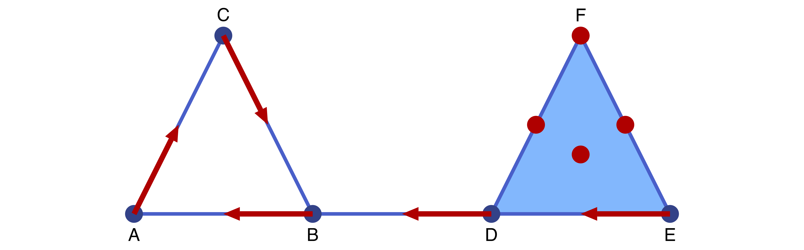
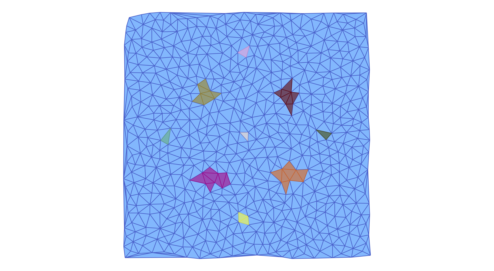

# Tutorial

This tutorial explains the basic usage of the main components of
`ConleyDynamics.jl`.  It is not meant to be exhaustive, and more details will be
provided in the more indiviualized sections. Also, precise mathematical
definitions will be delayed until then. The presented examples are taken from
the papers [batko:etal:20a](@cite) and [mrozek:wanner:p21a](@cite), with minor
modifications.

## Creating Simplicial Complexes

The fundamental mathematical object for `ConleyDynamics.jl` is a Lefschetz complex
[lefschetz:42a](@cite). For now we note that both simplicial complexes and
cubical complexes are special cases, and `ConleyDynamics.jl` provides convenient
interfaces for generating them.

For the sake of simplicity, this tutorial only considers the case of a
simplicial complex. Recall that an *abstract simplicial complex* ``K`` is just a
collection of finite sets, called *simplices*, which is closed under taking
subsets. In other words, every subset of a simplex is again a simplex. Each
simplex ``\sigma`` has an associated *dimension* ``\dim\sigma``, which is one
less than the number of its elements. One usually calls simplices of dimension 0
*vertices*, *edges* have dimension 1, and simplices of dimension 2 are
*triangles*. It follows easily from these definitions that every simplex is the
union of its vertices.  The following notions associated with simplicial
complexes are important for this introduction:

- A *face* of a simplex is any of its subsets. Notice that every simplex is
  a face of itself, and it is the only face that has the same dimension
  as the simplex. Faces whose dimension is strictly smaller are referrred
  to as *proper faces*.
- The *boundary* of a simplex ``\sigma`` is the collection of all proper
  faces of ``\sigma``. For a triangle, this amounts to all three edges and
  all three vertices which are part of it.
- A *facet* of a simplex ``\sigma`` is any face ``\tau`` with dimension
  ``\dim\tau = \dim\sigma - 1``. Notice that the facets of a simplex are
  the faces in its boundary of maximal dimension.
- The *closure* of a subset ``K_0`` of a simplicial complex ``K`` consists of
  the collection of all faces of simplices in ``K_0``, and we denote the
  closure by ``\mathrm{cl}\, K_0``.
- A subset ``K_0`` of a simplicial complex ``K`` is called *closed*, if
  it equals its closure. In other words, ``K_0`` is closed if and only if
  for every simplex ``\sigma`` in ``K_0`` all of its boundary simplices
  are part of ``K_0`` as well. Thus, a closed subset of a simplicial
  complex is a simplicial complex in its own right.

In `ConleyDynamics.jl` it is easy to generate a simplicial complex. This requires two
objects:

- The vertices are described by a vector `labels` of string labels
  for the vertices of the simplicial complex. Thus, the length of the
  vector equals the number of vertices, and the k-th entry is the
  label for the k-th vertex.
- In addition, a second vector `simplices` has to describe enough
  simplices so that the simplicial complex is determined. This object
  is a vector of vectors, and the vector `simplices[k]` describes the
  index values of all the vertices in the k-th simplex. These indices
  are precisely the corresponding locations of the vertices in
  `labels`.

!!! note "Simplices via labels"
    It is also possible to specify the list of simplices using
    a `Vector{Vector{String}}`, i.e., as a vector of string vectors.
    In this case, the entry `simplices[k]` is a list of the labels
    of the vertices.

!!! warning "Watch the label length"
    It is expected that the labels in `labels` all have the same
    number of characters. This is due to the fact that when creating
    the simplicial complex, `ConleyDynamics.jl` automatically creates 
    labels for each of the simplices in ``K``, by concatenating the
    vertex labels. Not using a fixed label size could lead to 
    ambiguities, and will therefore raise an error message.


The following first example creates a simple simplicial complex.  The complex is
shown in the above figure, and it has six vertices which we label by the first
six letters.

```@example T1
using ..ConleyDynamics # hide
labels = ["A","B","C","D","E","F"]
simplices = [["A","B"],["A","C"],["B","C"],["B","D"],["D","E","F"]]
sc = create_simplicial_complex(labels,simplices)
fieldnames(typeof(sc))
```

Based on the simplex specifications, the generated simplicial complex ``K``
consists of three edges connecting each of the vertices `A`, `B`, and `C`, a
two-dimensional triangle `DEF`, as well as the edge `BD` which connects the
triangle boundary and the filled triangle. The created struct `sc` is of type
`LefschetzComplex`, with fieldnames as indicated in the above output. The number
of cells in the complex can be seen as follows:

```@example T1
println(sc.ncells)
```

Note that the final simplicial complex has a total of seven edges, since also
the edges of `DEF` are part of the simplicial complex. They are automatically
generated by `create_simplicial_complex`. The dimension of ``K`` is the largest
simplex dimensions, and can be recalled via

```@example T1
println(sc.dim)
```

The `sc` struct contains a vector of labels, which in this case takes the form

```@example T1
println(sc.labels)
```

Finally, the Lefschetz complex data structure for our simplicial complex ``K``
includes the dimensions for the corresponding cells in the integer vector
`sc.dimensions`, a dictionary `sc.indices` which associates each simplex label
with its integer index, and the boundary map `sc.boundary` which will be
described in more detail in [Lefschetz Complexes](@ref). The latter map
is internally stored as a sparse matrix over either a finite field or over
the rationals. See also the discussion of [Sparse Matrices](@ref).

## Computing Homology and Persistence

Any simplicial complex, and in fact any Lefschetz complex, has an associated
*homology*. Informally, homology describes the connectivity structure of the
simplicial complex. More precisely, the homology consists of a sequence of
integers, called the *Betti numbers*, which are indexed by dimension. There are
Betti numbers ``\beta_k(K)`` for every ``k = 0,\ldots,\dim K``. The
zero-dimensional Betti number ``\beta_0(K)`` gives the number of connected
components of ``K``, while ``\beta_1(K)`` counts the number of independent loops
that can be found in ``K``. Finally, ``\beta_2(K)`` equals the number of
cavities. In our case, we have

```@example T1
homology(sc)
```

This means that the simplicial complex ``K`` has one component, as well as one
loop, and no cavities. The function `homology` returns a vector of integers,
whose k-th entry is ``\beta_{k-1}(K)``. We would like to point out that in
`ConleyDynamics.jl` all homology computations are performed over fields, and 
therefore homology is completely described by the Betti numbers. Two types
of fields are supported, and they are selected by the characteristic `p` in
the sparse boundary matrix:

- If `p=0`, then the homology computation uses the field of rational numbers.
- For any prime number `p`, homology is determined over the finite field
  ``GF(p)`` with `p` elements. 

`ConleyDynamics.jl` also allows for the computation of *relative homology*. In the
case of relative homology, together with the simplicial complex ``K`` one has to
specify a closed subcomplex ``K_0``. Intuitively, the relative homology
``H_*(K,K_0)`` is the homology of a new space, which is obtained from ``K`` by
identifying ``K_0`` to a single point, and then decreasing the zero-dimensional
Betti number by 1. Consider for example the following command:

```@example T1
relative_homology(sc, [1,6])
```

In this case, the subcomplex ``K_0`` consists of the two vertices `A` and `F`,
which are therefore glued together. This leads to zero Betti numbers in
dimension 0 and 2 (remember that the zero-dimensional Betti number is decreased
by 1!), and a one-dimensional Betti number of 2. The latter is increased by one
since we obtain a second loop by moving from `A` to `F = A` along the edges
`AB`, `BD`, and `DF`.  Another example is the following:

```@example T1
relative_homology(sc, ["DE","DF","EF"])
```

Now the subcomplex ``K_0`` consists of the edges `DE`, `DF`, and `EF` --
together with the three vertices `D`, `E`, and `F` which are automatically added
by `relative_homology`. Identifying them all to one point creates a hollow
two-dimensional sphere, and the relative Betti numbers reflect that fact.

As the above two examples demonstrate, the subcomplex can be specified either as
a list of simplex indices, or through the simplex labels.  Moreover, the
specfied subspace simplex list is automatically extended by `relative_homology`
to include all simplex faces, i.e., it computes the simplicial closure to arrive
at a closed subcomplex. Finally, note that the subcomplex can be empty:

```@example T1
relative_homology(sc, [])
```

As expected, in this case one obtains the standard homology of `sc`.

In addition to regular and relative homology, `ConleyDynamics.jl` can also compute
*persistent homology*. For this, one has to specify a *filtration* of closed
Lefschetz complexes

```math
  K_1 \subset K_2 \subset \ldots \subset K_m .
```

Persistent homology tracks the appearance and disappearance (also often
called the *birth* and *death*) of topological features as one moves through
the complexes in the filtration. In `ConleyDynamics.jl`, one can specify a Lefschetz
complex filtration by assigning the integer ``k`` to each simplex that first
appears in ``K_k``. Moreover, it is expected that ``K_m = K``. Then the
persistent homology is computed via the following command:

```@example T1
filtration = [1,1,1,2,2,2,1,1,1,3,2,2,2,4]
phsingles, phpairs = persistent_homology(sc, filtration)
```

The function returns the *persistence intervals*, which give the birth and
death indices of each topological feature in each dimension. There are two
types of intervals:

- Intervals of the form ``[a,\infty)`` correspond to topological
  features that first appear in ``K_a`` and are still present
  in the final complex. The starting indices of such features
  in dimension `k` are contained in the list `phsingles[k+1]`.
- Intervals of the form ``[a,b)`` correspond to topological
  features that first appear in ``K_a`` and first disappear
  in ``K_b``. The corresponding pairs `(a,b)` in dimension
  `k` are contained in the list `phpairs[k+1]`.

In our above example, one observes intervals ``[1,\infty)`` in dimensions zero
and one -- and these correspond to a connected component and the loop generated
by the edges `AB`, `AC`, and `BC`. These appear first in ``K_1`` and are still
present in ``K_4``. The interval ``[2,3)`` in dimension zero represents the new
component created by ``K_2``, and it disappears through merging with the older
component from ``K_1`` when the edge `BD` is introduced with ``K_3``.
Similarly, the interval ``[2,4)`` in dimension one is the loop created by the
triangle `DE`, `DF`, and `EF` in ``K_2``, which disappears with the introduction
of the triangle `DEF` in ``K_4``. Note that the interval death times respect the
*elder rule*: When for example a component disappears through merging, the
younger interval gets killed, and the older one continues to live. Similarly in
higher dimensions.

## Forman Vector Fields

The main focus of `ConleyDynamics.jl` is on the study of *combinatorial topological
dynamics* on Lefschetz complexes. While the phase space as Lefschetz complex has
been discussed above, albeit only for the special case of a simplicial complex,
the dynamics part can be given in the simplest form by a *combinatorial vector
field*, also called a *Forman vector field* [forman:98a, forman:98b](@cite).
We will soon see that such vector fields are a more restrictive version of
*multivector fields*, but they are easier to start with.  The following command
defines a simple Forman vector field on our sample simplicial complex ``K`` from
above:

```@example T1
formanvf = [["A","AC"],["B","AB"],["C","BC"],["D","BD"],["E","DE"]]
```

The Forman vector field `formanvf` is viualized in the accompanying figure.



According to the figure, a Forman vector field is comprised of *arrows*, as well
as *critical cells* which are indicated by red dots. Every simplex of the
underlying simplicial complex is either critical, or it is contained in a unique
arrow. In other words, the collection of critical cells and arrows forms a
partition of the simplicial complex ``K``. Arrows always have to consist of
precisely two simplices: The source of the arrow is a simplex ``\sigma^-``,
while its target is a second simplex ``\sigma^+``. These two simplices have to
be related in the sense that ``\sigma^-`` is a facet of ``\sigma^+``.

As the above Julia code shows, a forman vector field is described by a vector of
string vectors, where each of the latter contains the labels of the two
simplices making up an arrow. Note that the critical cells are not explicitly
listed, as any simplex of ``K`` that is not part of a vector is automatically
assumed to be critical. Alternatively, one could define the Forman vector field
as a `Vector{Vector{Int}}`, if the labels are replaced by the corresponding
indices in `sc.indices`.

Intuitively, the visualization of our sample Forman vector field `formanvf`
induces the following *dynamical behavior* on the simplicial complex `sc`:

- __Critical cells__ can be though of as *equilibrium states* for the
  dynamics, i.e., they contain a stationary solution. However, depending
  on their dimension they can also exhibit nonconstant dynamics --
  which in backward time converges to the equilibrium, and in forward
  time flows towards the boundary of the simplex.
- __Arrow sources__ always lead to flow into the interior of their
  target simplex ``\sigma^+``.
- __Arrow targets__ create flow towards the boundary of ``\sigma^+``,
  except towards the source facet ``\sigma^-``.

In the above figure, for example, the simplex `EF` is a critical cell, so it
contains an equilibrium. At the same time, it also allows for flow towards the
boundary, which consists of the vertices `E` and `F`.  A solution flowing to the
former then has to enter `DE`, flow through `D` to `BD`, before entering the
periodic orbit given by

```math
   B \to AB \to A \to AC \to C \to BC \to B \to AB \to \ldots
```

This heuristic description can be made precise. It was shown in
[mrozek:wanner:21a](@cite) that for every Forman vector field on a simplicial
complex there exists a classical dynamical system which exhibits dynamics
consistent with the above interpretation.

## Isolated Invariant Sets

The global dynamical behavior of a Forman vector field on a simplicial complex
can be described by first decomposing it into smaller building blocks. An
*invariant set* is a subset ``S \subset K`` of the simplicial complex such that
for every simplex ``\sigma \in S`` there exists a solution through ``\sigma``
which is contained in ``S`` and which exists for all forward and backward time.
In our example the following are sample invariant sets:

- Every critical cell ``\sigma`` by itself is an invariant set, since we can
  choose the constant solution ``\sigma`` in the above definition. Thus, also
  every union of critical cells is invariant.
- The periodic orbit ``S_P = \{ A, B, C, AB, AC, BC \}`` is an invariant set,
  since the periodic orbit mentioned earlier exists for all forward and
  backward time in ``S_P`` and passes through every simplex of the orbit.

While it is tempting to try to decompose the dynamics into invariant sets and
"everything else", Conley realized that a better theory can be built around
invariant sets which are isolated [conley:78a](@cite). In our combinatorial
setting, an *isolated invariant set* is an invariant set ``S \subset K`` with
the following two additional properties:

- The set ``S`` is *locally closed*, i.e., the associated set ``\mathrm{mo}\, S
  = \mathrm{cl}\, S \setminus S`` is closed in the simplicial complex. Recall
  that the closure ``\mathrm{cl}\, A`` of a set ``A \subset K`` consists of all
  simplices which are subsets of simplices in ``A``, and a set is closed if
  it equals its closure. The set ``\mathrm{mo}\, S`` is called the *mouth*
  of ``S``.
- The set ``S`` is *compatible* with the Forman vector field, i.e., the set
  is the union of critical cells and arrows. In other words, if one of the 
  arrow ends is contained in ``S``, then so is the other.

One can easily see that the periodic orbit ``S_P`` is an isolated invariant set,
since it is compatible and closed -- and therefore ``\mathrm{mo}\, S_P =
\emptyset`` is closed. Similarly, the single critical simplex ``S_1 = \{ DEF
\}`` is an isolated invariant set, since in this case the set ``\mathrm{mo}\, S_1
= \{ D, E, F, DE, DF, EF \}`` is closed, and ``S_1`` is compatible. On the other
hand, the invariant set ``S_2 = \{ DEF, F \}`` is not an isolated invariant set,
since the mouth ``\mathrm{mo}\, S_2 = \{ D, E, DE, DF, EF \}`` is not closed --
despite the fact that ``S_2`` is compatible.  For an example of an invariant set
which has a closed mouth but is not compatible, see [kaczynski:etal:16a; Figure
5](@cite).

It follows from the definition of isolation that for every isolated invariant
set ``S \subset K`` the two sets ``\mathrm{cl}\, S`` and ``\mathrm{mo}\, S`` are
closed, and that the latter is a (possibly empty) subset of the former. Thus,
the relative homology of this pair is defined and we let

```math
  CH_*(S) = H_*(\mathrm{cl}\, S, \mathrm{mo}\, S)
```

denote the *Conley index* of the isolated invariant set. The Conley index can
be computed using the command `conley_index`. For the three critical cells `F`,
`DF`, and `DEF` one obtains the following Conley indices:

```@example T1
println(conley_index(sc, ["F"]))
println(conley_index(sc, ["DF"]))
println(conley_index(sc, ["DEF"]))
```

In other words, the Conley index of a critical cell of dimension ``k`` has
Betti number ``\beta_k = 1``, while the remaining Betti numbers vanish. This
is precisely the relative homology of a ``k``-dimensional sphere with respect
to a point on the sphere. On the other hand, for the Conley index of the
periodic orbit ``S_P`` one obtains:

```@example T1
conley_index(sc, ["AB", "AC", "BC", "A", "B", "C"])
```

This Conley index is nontrivial in dimensions ``0`` and ``1``. This is
exactly the Conley index of an attracting periodic orbit in classical
dynamics.

## Connection Matrices

One of the main features of `ConleyDynamics.jl` is its capability to take a given
combinatorial vector or multivector field on an arbitrary Lefschetz complex and
determine its global dynamical behavior. This is done by computing the
connection matrix, which in our setting is discussed in detail in
[mrozek:wanner:p21a](@cite).  For the sample simplicial complex `sc` and the
Forman vector field `formanvf` the connection matrix information can be
determined as follows:

```@example T1
cm = connection_matrix(sc, formanvf)
fieldnames(typeof(cm))
```

This command calculates the connection matrix over the finite field
``GF(2) = {\mathbb Z}_2``. The base field for this computation is
determined by the data type of the boundary matrix in the underlying
simplicial complex `sc`. By default, if one uses the function
[`create_simplicial_complex`](@ref) without specifying the field
characteristic `p`, the simplicial complex is created over the
finite field ``\mathbb{Z}_2``, i.e., with `p=2`.

The `connection_matrix` function returns a struct which
contains the following information regarding the global dynamics of the
combinatorial dynamical system:

- The field `cm.morse` contains the *Morse decomposition* of
  the Forman vector field. This is a collection of isolated invariant
  sets which capture all recurrent behavior. Outside of these sets, the
  dynamics is gradient-like, i.e., it moves from one Morse set to
  another.
- Since each of the Morse sets is an isolated invariant set, they
  all have an associated Conley index. These are contained in the
  field `cm.conley`.
- In addition, the struct `cm` contains information on the actual
  *connection matrix* in the field `cm.matrix`. While the field contains
  the matrix, the rows and columns of the connection matrix correspond
  to the simplices in the underlying simplicial complex `sc` listed in
  `cm.labels`. These simplices represent the basis for the homology
  groups of all the Morse sets. Moreover, a nonzero entry in the
  connection matrix indicates that there has to be a connecting
  orbit between the Morse set containing the column label and the
  Morse set containing the row label.

The remaining field names of the struct `cm` are described in
the section on [Conley Theory](@ref).

For our example system, the Morse sets are given by

```@example T1
cm.morse
```

There are five of them: The stable periodic orbit ``S_P`` mentioned earlier, the
stable critical state `F`, the unstable equilibria `DF` and `EF`, as well
as the two-dimensional unstable critical cell `DEF`.  The associated Conley
indices are

```@example T1
cm.conley
```

Clearly these indices are exactly as described in the homology section, since
the underlying field is still ``\mathbb{Z}_2``, as determined by `sc`. For an
example which involves computations over different fields, which also lead
to different Conley indices, we refer to the function [`example_moebius`](@ref).

Finally, the connection matrix itself is contained in `cm.matrix`. Since internally
the connection matrix is stored in a sparse format, we display it after
conversion to a full matrix:

```@example T1
full_from_sparse(cm.matrix)
```

In order to see which simplices represent the columns of the matrix, we use
the command

```@example T1
println(cm.labels)
```

The right-most column contains two nonzero entries, and they imply that there
are connecting orbits between the critical cell `DEF` and the two critical
cells `DF` and `EF`, respectively. The second-to-last column establishes
connecting orbits originating from `EF`. One of these ends at the critical
vertex `F`, while the other one leads to `A`. Notice, however, that since
`A` is part of the Morse set ``S_P``, i.e., the periodic orbit, this second
nonzero entry in the column implies the existence of a heteroclinic orbit
between the equilibrium and the complete periodic solution. Similarly, there are
connections between `DF` and both `F` and the periodic orbit, in view of the
fourth column of the connection matrix.

A description of the remaining fields of `cm` can also be found in the API entry
for [`connection_matrix`](@ref). We would like to emphasize again that internally,
all computations necessary for finding the connection matrix are performed
automatically over the rationals or over the finite field ``GF(p)``. The choice
depends on the data type of the boundary matrix for the underlying Lefschetz
complex, in this case the simplicial complex `sc`. 

## Multivector Fields

As second example of this tutorial we turn our attention to the
logo of `ConleyDynamics.jl`. It shows a simple multivector field on a simplicial
complex, and both the simplicial complex `sclogo` and the multivector field
`mvflogo` can be defined using the commands

```@example T2
using ..ConleyDynamics # hide
labels = ["A","B","C","D"]
simplices = [["A","B","C"],["B","C","D"]]
sclogo = create_simplicial_complex(labels,simplices)
mvflogo = [["A","AB"],["C","AC"],["B","BC","BD","BCD"]]
```

This example is taken from [mrozek:wanner:p21a; Figure 1](@cite), and is
visualized in the accompanying figure.


The multivector field `mvflogo` clearly has a different structure from the
earlier Forman vector field. While the latter consists exclusively of arrows
and critical cells, the former is made up of *multivectors*. In this context
a *multivector* is a collection of simplices which form a locally closed
set, as defined earlier in the tutorial. One can show that in the case of
a simplicial complex, this is equivalent to requiring that if ``\sigma_1
\subset \sigma_2`` are two simplices in the multivector, then so are all
simplices ``\tau`` with ``\sigma_1 \subset \tau \subset \sigma_2``.  In
other words, multivectors are convex with respect to simplex inclusion, 
i.e., with respect to the face relation.  A *multivector field* is then
a partition of the simplicial complex into multivectors.
See [lipinski:etal:23a](@cite) for more details.

It is not difficult to see that every Forman vector field is a multivector
field. Every critical cell consists of just one simplex, so it trivially
satisfies the above convexity condition. In addition, the two simplices
contained in an arrow do not allow for any simplex ``\sigma^- \subset \tau
\subset \sigma^+`` apart from ``\tau = \sigma^\pm``.  As in the case of Forman
vector fields, multivector fields in `ConleyDynamics.jl` only need to list
multivectors containing at least two simplices. Any simplex not contained on the
list automatically gives rise to a one-element multivector.

One important difference between Forman vector fields and multivector fields
is the definition of criticality. In the multivector field case, the types
of multivectors are distinguished as follows:

- A multivector ``V`` is called *critical*, if the relative homology
  ``H_*(\mathrm{cl}\, V, \mathrm{mo}\, V)`` is not trivial, i.e., at least
  one Betti number is nonzero.
- A multivector ``V`` is called *regular*, if the relative homology
  ``H_*(\mathrm{cl}\, V, \mathrm{mo}\, V)`` is trivial, i.e., it vanishes
  in all dimensions.

One can show that in the case of a Forman vector field, critical cells
are always critical in the above sense, while arrows are always regular.
In our above example `mvflogo`, all three multivectors which are not
singletons are regular. For example, the following computation shows
that the cell `ABC` is a critical cell:

```@example T2
cl1, mo1 = lefschetz_clomo_pair(sclogo, ["ABC"])
relative_homology(sclogo, cl1, mo1)
```

The first command creates the closure-mouth pair associated with
the cell `ABC`, i.e., the variable `cl1` is the closed triangle,
while `mo1` is the closed boundary of the triangle. The next 
command determines the relative homology. Notice that this employs
another method under the name [`relative_homology`](@ref), in
contrast to the one used earlier in this tutorial. For more
details, see [Homology Functions](@ref).

Alternatively, since every multivector is locally closed, one can
also use the function [`conley_index`](@ref) for the same computation:

```@example T2
conley_index(sclogo, ["ABC"])
```

Similarly, the next sequence of commands verifies that the third
nontrivial multivector `mvflogo[3]` is indeed a regular multivector:

```@example T2
cl2, mo2 = lefschetz_clomo_pair(sclogo, mvflogo[3])
relative_homology(sclogo, cl2, mo2)
```

The global dynamics can again be determined using the function
[`connection_matrix`](@ref):

```@example T2
cmlogo = connection_matrix(sclogo, mvflogo)
cmlogo.morse
```

As it turns out, our logo gives rise to three Morse sets, which in fact
partition the simplicial complex. Their Conley indices are given by

```@example T2
cmlogo.conley
```

Finally, the connection matrix has the form

```@example T2
full_from_sparse(cmlogo.matrix)
```

Notice that in this example, only the connection between the Morse
set `ABC` and the large index 1 Morse set comprising almost all 
of the simplicial complex can be detected algebraically. In fact,
there are two connections between the large Morse set and the
stable equilibrium `D`, and they cancel algebraically.

## Analyzing Planar Vector Fields

Our third and last example of the tutorial briefly indicates how
`ConleyDynamics.jl` can be used to analyze the global dynamics of
certain planar ordinary differential equations. For this, consider
the planar system given by

```math
   \begin{array}{rcl}
     \dot{x}_1 & = & x_1 \left( 1 - x_1^2 - 3 x_2^2 \right) \\[1ex]
     \dot{x}_2 & = & x_2 \left( 1 - 3 x_1^2 - x_2^2 \right)
   \end{array}
```

The right-hand side of this vector field can be implemented using
the Julia function

```@example T3
using ..ConleyDynamics # hide
using Random # hide
Random.seed!(1234) # hide
function planarvf(x::Vector{Float64})
    #
    # Sample planar vector field with nontrivial Morse decomposition
    #
    x1, x2 = x
    y1 = x1 * (1.0 - x1*x1 - 3.0*x2*x2)
    y2 = x2 * (1.0 - 3.0*x1*x1 - x2*x2)
    return [y1, y2]
end
```

To analyze the global dynamics of this vector field, we first create
a Delaunay triangulation of the square ``[-3/2, 3/2]^2`` using the
commands

```@example T3
lc, coords = create_simplicial_delaunay(300, 300, 10, 30);
coordsN = convert_planar_coordinates(coords,[-1.5,-1.5], [1.5,1.5]);
cx = [c[1] for c in coordsN];
(minimum(cx), maximum(cx))
```

The first command generates the triangulation in a square box with 
side length 300, while trying to keep a minimum distance of about 10
between vertices. Once this has been accomplished, the second 
command transforms the coordinates to the desired square domain.
As the last two commands show, the resulting x-coordinates do indeed
lie between -3/2 and 3/2.

Next we can create a multivector field which describes the flow behavior
through the edges of the triangulation. Basically, for each edge which
is traversed in only one direction, the corresponding multivector
respects this unidirectionality, while non-transverse edges lead
to multivectors which allow for flow in both directions between the
adjacent triangles. This is achieved with the commands

```@example T3
mvf = create_planar_mvf(lc, coordsN, planarvf);
mvf[1:3]
```

The first command generates the multivector field, while the second
one merely displays the first three resulting multivectors. Note that
if the discretization is too coarse, this might lead to large multivectors
that cannot resolve the underlying dynamics. In our case, we can analyze
the global dynamics of the created multivector field using the commands

```@example T3
cm = connection_matrix(lc, mvf);
cm.conley
```

As the output shows, this planar system has nine isolated invariant sets:

* One unstable equilibrium of index 2,
* four unstable equilibria of index 1,
* and four stable equilibria.

More precisely, this computation does not in fact establish the existence
of these equilibria, but of corresponding isolated invariant sets which have
the respective Conley indices. The connection matrix is given by

```@example T3
full_from_sparse(cm.matrix)
```

It shows that there are twelve connecting orbits that are forced by the
algebraic topology. Finally, we can visualize the Morse sets using the
command

```julia
fname = "tutorialplanar.pdf"
plot_planar_simplicial_morse(lc, coordsN, fname, cm.morse, pv=true)
```



## Tutorial References

See the [full bibliography](@ref References) for a complete list
of references cited throughout this documentation. This section cites
the following references:

```@bibliography
Pages = ["tutorial.md"]
Canonical = false
```

